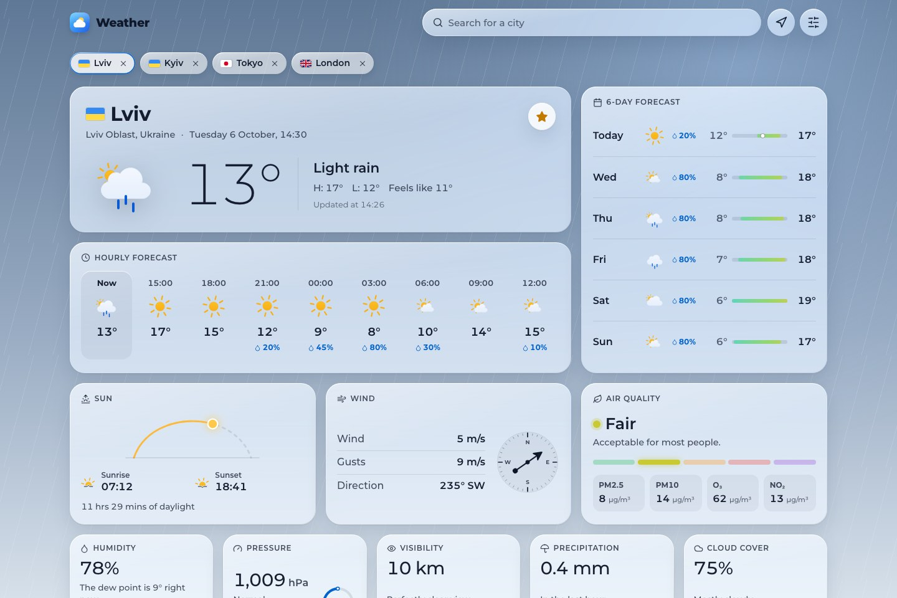
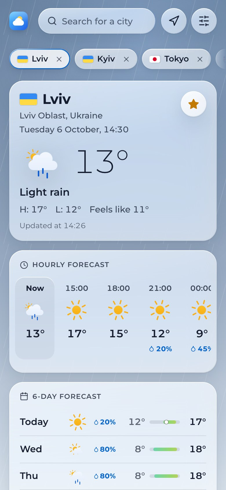
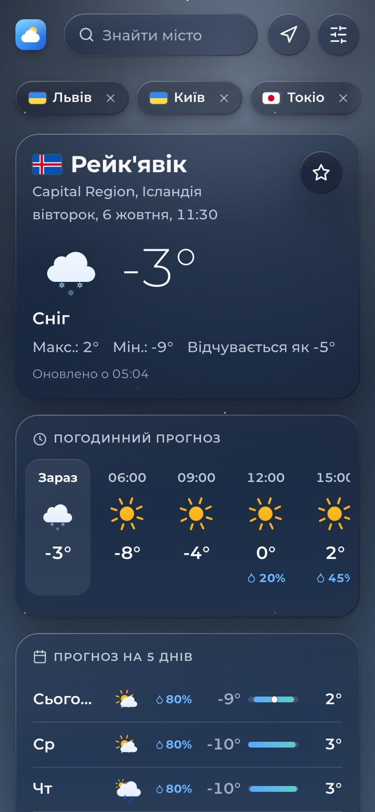
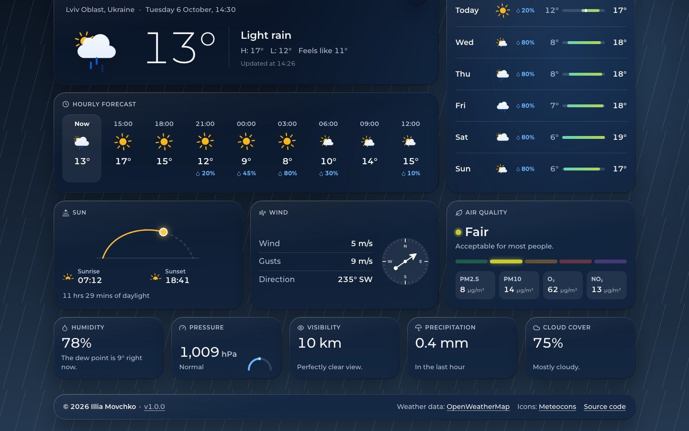

# ⛅ Weather

[](https://github.com/sacrificed666/weather/actions/workflows/ci.yml)
[](https://github.com/sacrificed666/weather/actions/workflows/codeql.yml)

The weather for any city in the world on one calm, glassy screen: what it is like outside right now, the next 24 hours, the coming week, the air you breathe and the sun's path across the sky. Built with Next.js 16, React 19 and TypeScript 7 on top of OpenWeatherMap, rendered on the server, in ten languages, accessible, light or dark, and the sky behind the cards changes with the weather.

<picture>
  <source media="(prefers-color-scheme: dark)" srcset="./docs/images/desktop-dark.jpg" />
  
</picture>

## ✨ Highlights

- 🌤️ **Current weather**: temperature, conditions, today's high and low, the apparent temperature and the city's own clock
- 🌌 **Living sky**: a clear, cloudy, rainy, stormy, snowy or foggy sky behind the cards, by day and by night
- 🕒 **Hourly and daily**: the next 24 hours in three-hour steps with the chance of rain, and up to seven days with temperature bars on one shared scale
- 📊 **Details**: the sun's path from sunrise to sunset, air quality with PM2.5, PM10, ozone and nitrogen dioxide, wind with a compass, humidity and dew point, pressure, visibility, precipitation and cloud cover in compact tiles, each with a sentence that explains the number
- 🔎 **Search and location**: suggestions in any language (`Lviv`, `Львів`, `Lemberg`), full keyboard control, recent searches and **Use my location**
- ⭐ **Saved places**: star a city to pin it above the forecast, named in your language and never twice, and switch between your places in one tap
- 🌍 **Ten languages**: English, Ukrainian, Czech, German, Spanish, French, Italian, Dutch, Polish and Portuguese, each under its own address, including the weather descriptions and place names
- ⚙️ **Your way**: light, dark or automatic theme, metric (°C, m/s, hPa) or imperial (°F, mph, inHg) units and full or reduced effects, rendered by the server without a flash
- ♿ **Accessible**: landmarks, a skip link, live regions, a real combobox, reflow down to 320 px and support for reduced motion, reduced transparency, more contrast and forced colours, checked with axe in every build
- 🔎 **Search-friendly**: canonical and `hreflang` links, a share card per language, a sitemap, robots rules and JSON-LD with the place of every forecast
- ⚡ **Fast**: server components, a 10-minute shared cache for OpenWeatherMap responses, a streamed dashboard and a Lighthouse budget in CI
- 🛡️ **Safe**: the API key never leaves the server, a nonce-based Content Security Policy, validated input and a rate-limited search endpoint

<p align="center">
  
  
</p>



## ⚛️ Front-end


## 🧰 Tooling


TypeScript 7 · Oxlint · Oxfmt · Vitest 5 · Testing Library · Playwright · axe · Lighthouse · React Compiler · CodeQL

## 🚀 Quick start

Requires **Node.js 24** or newer (26, the newest line, is recommended in `.nvmrc`) and a free [OpenWeatherMap API key](https://home.openweathermap.org/api_keys).

```bash
npm ci
cp .env.example .env         # then paste your key into OPENWEATHERMAP_API_KEY
npm run dev                  # http://localhost:3000, redirects to your language
```

> [!NOTE]
> OpenWeatherMap can take up to two hours to activate a new key. Until then the app explains that the key was rejected.

```bash
npm run check                # lint, format check, type check and unit tests in one go
npm run test:e2e             # browsers, accessibility and Lighthouse against a mock OpenWeatherMap API
npm run build && npm start   # production build
```

🐳 The same app runs in Docker, with an overlay for every environment, see [Deployment](./docs/deployment.md#-docker):

```bash
docker compose -f compose.yaml -f docker/development.yaml up --watch
```

> [!TIP]
> No key yet? `node e2e/openweather-api.ts` starts the mock API from the end-to-end tests; see [Getting started](./docs/getting-started.md#-install-and-run).

## 📚 Documentation

| Guide                                           | Topics                                                       |
| ----------------------------------------------- | ------------------------------------------------------------ |
| 🏁 [Getting started](./docs/getting-started.md) | Requirements, environment variables, scripts and layout      |
| ✨ [Features](./docs/features.md)               | Everything the app can do, addresses and states              |
| 🏗️ [Architecture](./docs/architecture.md)       | Layers, rendering, routes, languages, preferences and places |
| 🌦️ [Weather data](./docs/weather-data.md)       | OpenWeatherMap endpoints, caching, normalization and icons   |
| 🎨 [Design system](./docs/design.md)            | Glass surfaces, skies, tokens, layout and motion             |
| 🌍 [Localization](./docs/i18n.md)               | Language addresses, messages, formatting, adding a language  |
| ♿ [Accessibility](./docs/accessibility.md)     | Semantics, keyboard, screen readers, contrast and reflow     |
| 🔎 [SEO](./docs/seo.md)                         | Metadata, canonical links, share cards and structured data   |
| 🛡️ [Security](./docs/security.md)               | Content Security Policy, the API key, validation and limits  |
| 🧪 [Testing](./docs/testing.md)                 | Unit and browser tests, the mock API, axe and Lighthouse     |
| 🚀 [Deployment](./docs/deployment.md)           | CI, the build report, Vercel, Docker and self-hosting        |
| 🏷️ [Releases](./docs/releases.md)               | Versions, branches, the changelog and environments           |
| 🤝 [Contributing](./docs/contributing.md)       | Workflow, code style and commit conventions                  |
| ❓ [FAQ](./docs/faq.md)                         | Common questions                                             |

## 📌 Good to know

- 🔑 **A free API key is enough.** When the key does not include the daily forecast, the week is built from the free 5-day / 3-hour forecast instead.
- 🔒 **Nothing is tracked.** Preferences are four cookies, saved places stay in your browser, and the browser only talks to the app itself.
- 🐢 **Effects follow the device.** Windows and Android get flat glass without blur and a still sky by default; **Settings → Effects → Full** brings the blur and the motion back.
- 🗃️ **Weather is cached for 10 minutes** on the server, so many visitors of one city cost one request.

> [!IMPORTANT]
> Keep `OPENWEATHERMAP_API_KEY` on the server: never add a `NEXT_PUBLIC_` prefix, which would publish it in the JavaScript of every visitor.

## ✍️ Author

**[Illia Movchko](https://github.com/sacrificed666)**

## ✨ Credits

- **[Bas Milius](https://github.com/basmilius)**: _[Meteocons](https://bas.dev/work/meteocons)_ weather icons
- **[OpenWeatherMap](https://openweathermap.org)**: weather, forecast, air quality and geocoding data
- **[country-flag-icons](https://gitlab.com/catamphetamine/country-flag-icons)**: country flags
- **[Lucide](https://lucide.dev)**: the shapes behind the interface icons
- **[Montserrat](https://github.com/JulietaUla/Montserrat)**: the typeface, under the SIL Open Font License

## 📝 License

Licensed under the **[MIT License](https://choosealicense.com/licenses/mit/)**.
