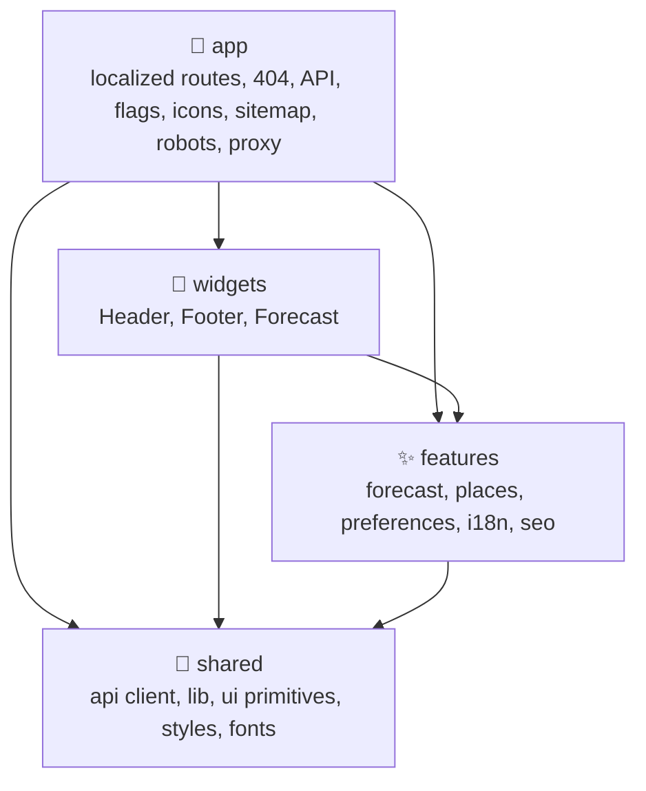
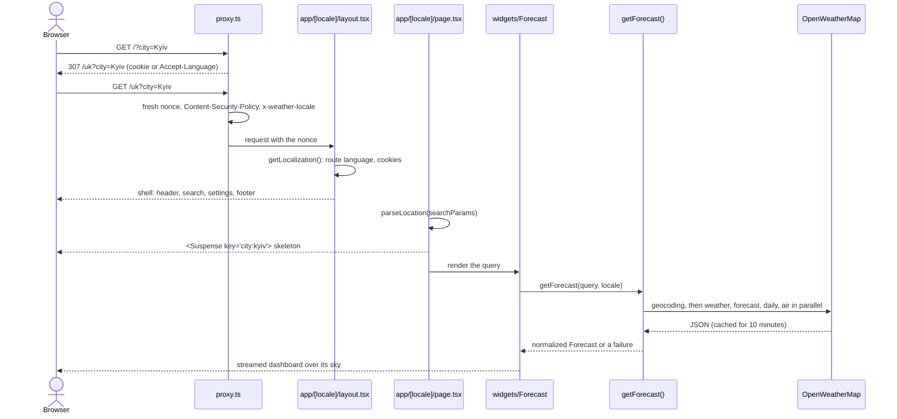
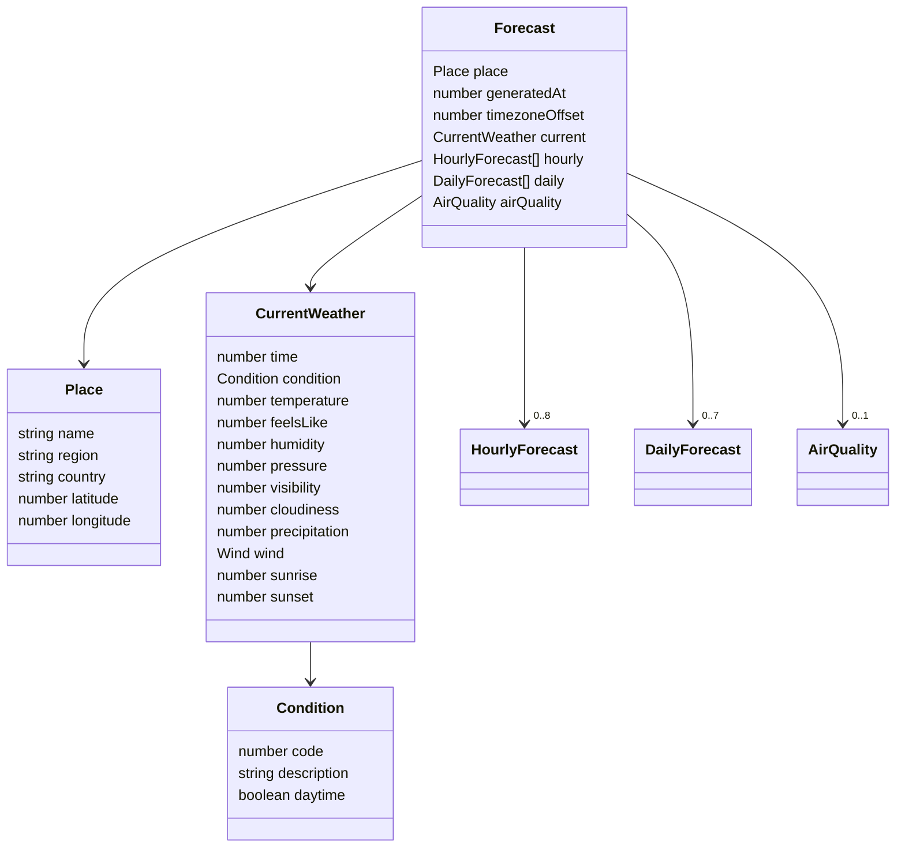
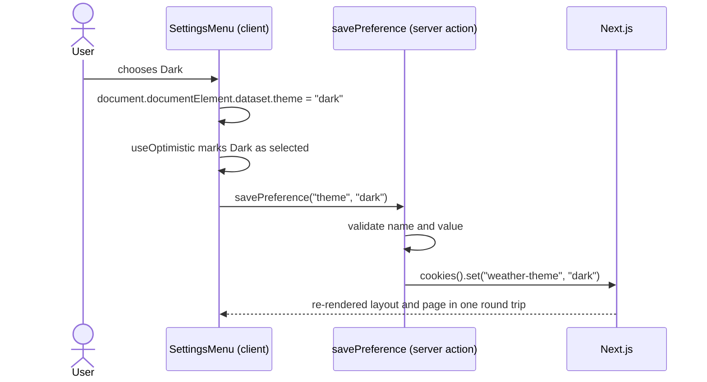

# 🏗️ Architecture

## 🧱 Technology stack

| Area         | Choice                                                                                               |
| ------------ | ---------------------------------------------------------------------------------------------------- |
| ⚛️ UI        | React 19.3 with the React Compiler (automatic memoization)                                           |
| 🧭 Framework | Next.js 16 App Router: server components, server actions, route handlers, `proxy.ts`, Turbopack      |
| 🌦️ Data      | OpenWeatherMap current weather, 5-day / 3-hour forecast, daily forecast, air pollution and geocoding |
| 🌍 i18n      | Eight hand-written message catalogs on top of `Intl` for numbers, units, dates and country names     |
| 🎨 Styling   | Sass modules, CSS custom properties, `color-mix()`, `:has()`, `@starting-style`, native popovers     |
| 🔷 Language  | TypeScript 7 in strict mode with `noUncheckedIndexedAccess`, `verbatimModuleSyntax` and route types  |
| ✅ Quality   | Oxlint (type-aware, React Compiler, Next.js, a11y and layer rules), Oxfmt, Vitest 5, Testing Library |

## 🧭 Layers

The source is organised by **feature**, in four layers. A layer may only import from the layers below it, and Oxlint's `no-restricted-imports` rule enforces this in `.oxlintrc.json`.



| Layer       | Folder                    | Contains                                                       | May import             |
| ----------- | ------------------------- | -------------------------------------------------------------- | ---------------------- |
| 🚀 App      | `src/app`, `src/proxy.ts` | Next.js routes and special files                               | everything             |
| 🧩 Widgets  | `src/widgets`             | Page regions that compose several features                     | features, shared       |
| ✨ Features | `src/features`            | One folder per capability with a `model/` and a `ui/`          | other features, shared |
| 🧰 Shared   | `src/shared`              | Domain-agnostic HTTP client, helpers, UI primitives and styles | shared only            |

| Feature          | Model                                                                                                            | UI                                                                                                              |
| ---------------- | ---------------------------------------------------------------------------------------------------------------- | --------------------------------------------------------------------------------------------------------------- |
| 🌦️ `forecast`    | `getForecast()`, response parsers, daily aggregation, condition icons and skies, insights, domain types          | `CurrentConditions`, `HourlyForecast`, `DailyForecast`, nine detail cards, `Sky`, `LocalClock`, skeleton, error |
| 📍 `places`      | `Place`, URL locations, geocoding, saved and recent places                                                       | `CitySearch`, `LocateButton`, `SavePlaceButton`, `SavedPlaces`                                                  |
| ⚙️ `preferences` | Theme, units and effects in cookies, the `savePreference` server action, the route language, `getLocalization()` | `SettingsMenu`, `OfflineNotice`                                                                                 |
| 🌍 `i18n`        | Locales, `matchLocale()`, path helpers, message catalogs, `createTranslator()`, `useI18n()`                      | `I18nProvider`                                                                                                  |
| 🔎 `seo`         | `alternates()`, `social()`, `documentTitle()`, `describeForecast()`, JSON-LD schemas, share card assets          | `JsonLd`                                                                                                        |

## 🔀 Request flow



- 🧊 **Server components by default.** The forecast cards are synchronous server components that receive `{ forecast, t, format }` as props; they ship no JavaScript. Only interactive parts are client components: search, location, the star, saved places, settings, the clock, the retry button and the offline notice.
- 🌊 **Streaming.** The layout and the page shell render at once; the forecast streams into a `Suspense` boundary. The boundary is keyed by the location (`locationKey()`), so opening another city shows the skeleton, while changing a setting keeps the current dashboard on screen until the new one is ready.
- 🔗 **The URL is the state.** The language is the first segment and the place lives in the query (`/uk?city=Kyiv` or `/uk?lat=50.45&lon=30.52`), so the back button, bookmarks and sharing work without client state. Search and location only call `router.push()` inside a transition.
- 🏷️ **Metadata.** `generateMetadata()` names the tab after the city and its weather (`Kyiv 17° · Clear sky · Weather`), adds the canonical and `hreflang` links and keeps failures out of the index. It calls `getForecast()` with the same arguments as the page, and Next.js deduplicates the identical `fetch` calls within the request. See [SEO](./seo.md).
- 🧩 **Structured data.** The `Forecast` widget renders JSON-LD for the site, the page and the place next to the dashboard, so it streams in with the forecast.

> [!NOTE]
> Without JavaScript the streamed dashboard stays hidden, because React moves it into place with a small script. The header, the search form and the title still work, and every search submits to a new address.

## 🗺️ Routes

| Route                            | Kind                       | Purpose                                                                         |
| -------------------------------- | -------------------------- | ------------------------------------------------------------------------------- |
| `/[locale]`                      | Dynamic page               | The forecast for `?city=`, `?lat=&lon=` or the default city, in eight languages |
| `/[locale]/opengraph-image/card` | Metadata image (SSG)       | The share card of each language, generated with `next/og` at build time         |
| `/api/places?q=&lang=`           | Route handler              | Search suggestions for the combobox, rate-limited, same-origin only             |
| `/flags/[code]`                  | Static route handler (SSG) | 265 country flags from `country-flag-icons`, prerendered at build time          |
| `/icons/weather/*.svg`           | Static files               | The Meteocons the app uses                                                      |
| `/icon.svg`, `/apple-icon`       | Metadata files             | App icons                                                                       |
| `/manifest.webmanifest`          | Metadata file              | Name, colours and icons for installing the app                                  |
| `/sitemap.xml`, `/robots.txt`    | Metadata files             | Every language of the home page, crawling rules                                 |
| Anything else                    | `global-not-found.tsx`     | **Page not found** with status 404, in the language of the address              |

`[locale]/layout.tsx` is the root layout: it renders `<html lang>` from the address, and `dynamicParams = false` limits the segment to the eight languages. `error.tsx` catches unexpected rendering errors below the layout, offers **Try again** (`retry()`) and shows the error's digest as a reference; `global-error.tsx` covers the layout itself.

### 🧭 Languages in the address

`src/proxy.ts` runs before every page and does three things:

| Request                     | Answer                                                                                                                              |
| --------------------------- | ----------------------------------------------------------------------------------------------------------------------------------- |
| `/uk?city=Kyiv`             | Passes on with a fresh nonce, the Content Security Policy and an `x-weather-locale: uk` header                                      |
| `/UK?city=Kyiv`             | `308` to `/uk?city=Kyiv`                                                                                                            |
| `/?city=Kyiv`, `/somewhere` | `307` to the saved language (`weather-locale` cookie) or the best match for `Accept-Language`, with `Vary: Accept-Language, Cookie` |

Server components read the language with `locale()` from `next/root-params` through `currentLocale()`, so it never has to be passed down.

> [!IMPORTANT]
> With the root layout inside a dynamic segment, a `notFound()` thrown by a page cannot fall back to a root `not-found.tsx`, and Next.js answers with an empty error shell. Unknown addresses are therefore left unmatched and rendered by `global-not-found.tsx`, which reads the language from the `x-weather-locale` header the proxy sets, then from the cookie and `Accept-Language`.

## 🗂️ Domain model



- 📏 **Metric inside.** Every value is stored in metric units (°C, m/s, hPa, m, mm) and converted only when it is formatted, so one cached response serves every unit system.
- 🕰️ **Unix seconds and an offset.** Times are UTC seconds; `timezoneOffset` is the city's offset in seconds. `toLocalDate()` shifts a timestamp and formatting always uses `timeZone: "UTC"`, so the server, the browser and the tests agree regardless of their own time zone.
- 🧭 **Codes, not words.** A `Condition` keeps the OpenWeatherMap code; icons and skies are derived from it, never from the localized description.

The full path from OpenWeatherMap JSON to these types is described in [Weather data](./weather-data.md).

## ⚙️ Preferences



| Cookie            | Values                                         | Default                              |
| ----------------- | ---------------------------------------------- | ------------------------------------ |
| `weather-theme`   | `system`, `light`, `dark`                      | `system`                             |
| `weather-units`   | `metric`, `imperial`                           | `metric`                             |
| `weather-effects` | `auto`, `full`, `reduced`                      | `auto`                               |
| `weather-locale`  | `en`, `uk`, `de`, `es`, `fr`, `it`, `nl`, `pl` | The best match for `Accept-Language` |

- 🍪 Theme, units and effects are saved by the server action in `HttpOnly`, `SameSite=Lax` cookies, `Secure` in production, for a year. Unknown names and values are ignored, so a crafted request cannot store anything else.
- 🌍 The language is the address. The language links in the settings point to the same place in another language and write `weather-locale` in the browser when clicked, so the next visit to an address without a language opens it. The proxy only reads the cookie to redirect; a shared `/de` link never changes it.
- 🖥️ `getPreferences()`, `currentLocale()`, `getLocalization()` and `getEffects()` are wrapped in React's `cache()`, so the layout, the page and the metadata read them once per request.
- 🎨 Because the server knows the theme, `<html data-theme>` is correct in the first byte: there is no inline theme script and no flash.
- ⚡ `getEffects()` resolves the effects level from the `weather-effects` cookie and the request's `User-Agent` (Auto means Full on Apple devices and Reduced elsewhere), writes it to `<html data-effects>` and tells the `Forecast` widget and the header whether `WeatherIcon` should load the animated or the still Meteocons. See [Design system](./design.md#-effects-and-performance).

## ⭐ Saved and recent places

Saved and recent places are browser-only state in `localStorage` (`next-weather-app/saved-places`, up to 12, and `next-weather-app/recent-places`, up to 5). `createStoredList()` in `shared/lib/storedList.ts` turns a key into an external store for `useSyncExternalStore`:

- 🛡️ every read goes through `parsePlace()`, so broken or edited storage falls back to an empty list;
- 🔄 the `storage` event keeps tabs in sync;
- 🖥️ the server snapshot is always empty, so hydration never mismatches and the chips appear right after it;
- 🚫 blocked storage (private modes) simply disables the feature.

## 🕰️ The live clock

`LocalClock` subscribes to a 15-second interval through `useSyncExternalStore` and re-renders only when the minute changes. The server passes `generatedAt` as the initial snapshot, and `suppressHydrationWarning` absorbs the rare case where the minute changes between the server render and hydration.

## 🗺️ Component map

```text
LocaleLayout                 app/[locale]/layout.tsx, <html lang data-theme>
├── I18nProvider             The messages of the current language for client components
├── Header
│   ├── CitySearch           Combobox with suggestions from /api/places and recent places
│   ├── LocateButton         Geolocation → /{language}?lat=&lon=
│   └── SettingsMenu         Popover with theme, units and links to every language
├── main
│   └── Page
│       ├── SavedPlaces      Chips from localStorage
│       └── Suspense         Keyed by the location, ForecastSkeleton as fallback
│           └── Forecast     Async server widget
│               ├── JsonLd               WebSite, WebPage and Place
│               ├── Sky                  Fixed background for the condition
│               ├── CurrentConditions    Place, LocalClock, SavePlaceButton, temperature
│               ├── HourlyForecast
│               ├── DailyForecast        TemperatureRange per day
│               └── Details              AirQuality, Sun, Wind, Humidity, FeelsLike, Pressure,
│                                        Visibility, Precipitation, CloudCover
├── Footer                   Credits and links
└── OfflineNotice            next/offline
```

## 🛠️ Tooling decisions

- ⚛️ **React Compiler** is enabled with `reactCompiler: true`, so components are written without `useMemo` or `useCallback`. Oxlint enables the matching rules (`purity`, `refs`, `immutability`, `set-state-in-effect` and others).
- 🔷 **TypeScript 7** checks the project with the native compiler; `next build` runs the project's own `tsc`, and Oxlint's type-aware rules use `oxlint-tsgolint`.
- 🧩 **Sass modules** keep styles next to their component. Turbopack resolves the `@/` alias inside `@use`, so every module imports tokens with `@use "@/shared/styles/mixins" as *`.
- 🤖 **No agent files.** `agentRules: false` keeps `next dev` from adding AI agent instruction files to the repository.
- 📴 **Offline detection** uses the experimental `useOffline` flag of Next.js 16.3, which also retries navigations and server actions once the connection is back.
- 🧭 **Global 404** uses the experimental `globalNotFound` flag, the recommended way to answer unmatched addresses when the root layout lives in a dynamic segment.
- 🛰️ **Configurable API address.** `OPENWEATHERMAP_API_URL` points the server at another OpenWeatherMap-compatible host; the end-to-end tests use it for their mock server.

> [!TIP]
> The documentation bundled with the installed Next.js version lives in `node_modules/next/dist/docs/`. It is the reference for APIs such as `next/root-params`, `global-not-found` and `proxy.ts`, which are newer than most tutorials.
