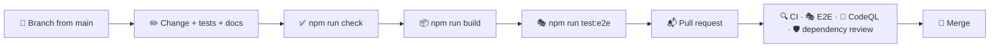

# 🤝 Contributing

## 🔄 Workflow



1. 🌿 Create a branch from `main`.
2. ✅ Make your changes, add tests and run `npm run check` (and `npm run build` when routes, server code or configuration changed). For changes a visitor can see, also run `npm run test:e2e`.
3. 📬 Open a pull request and fill in the checklist from the template.
4. 🔀 Merge once everything is green.

Bugs and ideas go through the issue forms in `.github/ISSUE_TEMPLATE`; security problems are reported privately as described in the [security policy](../.github/SECURITY.md).

> [!IMPORTANT]
> Keep `docs/` in sync with the code: a change to behaviour, a route, an environment variable or a script belongs in the same pull request as its documentation.

## 🧹 Code style

Formatting and linting are automated, so reviews can focus on behaviour.

- 🎨 **Oxfmt** formats TypeScript, SCSS, JSON, YAML and Markdown with a print width of 120 and sorts imports into groups. Run `npm run format`.
- 🧹 **Oxlint** enables the `correctness`, `suspicious` and `perf` categories with type-aware TypeScript rules, React hooks and React Compiler rules, the Next.js, `jsx-a11y`, `import`, `unicorn` and `vitest` plugins, plus the layer rules below. Run `npm run lint`.
- 🔷 **TypeScript** runs in strict mode with `noUncheckedIndexedAccess`, `verbatimModuleSyntax` and `erasableSyntaxOnly`.

### 🚫 No comments

The codebase contains no comments: names, small functions and types carry the intent instead. A custom Oxlint plugin in `lint/no-comments.js` (`local/no-comments`) reports every comment in JavaScript and TypeScript files, including `eslint-disable`-style directives. Styles, configuration, workflows and templates follow the same convention. If something needs explanation, prefer a better name, an extracted function or a paragraph in `docs/`.

### 🧭 Where code goes

| You are adding…                                        | Put it in                                           |
| ------------------------------------------------------ | --------------------------------------------------- |
| A localized page or one of its special files           | `src/app/[locale]/`                                 |
| An API endpoint or a file outside the languages        | `src/app/`                                          |
| Metadata, canonical links or structured data           | `src/features/seo/`                                 |
| A region of the page that combines several features    | `src/widgets/<Widget>/`                             |
| Data access, parsing or domain logic                   | `src/features/<feature>/model/`                     |
| A component that belongs to one feature                | `src/features/<feature>/ui/<Component>/`            |
| A helper or component that knows nothing about weather | `src/shared/lib`, `src/shared/ui`, `src/shared/api` |
| Design tokens and mixins                               | `src/shared/styles/`                                |

Imports only point downwards: `app → widgets → features → shared`. Oxlint reports any other direction.

> [!WARNING]
> Every link inside the app needs the language: build it with `homeHref()`, `placeHref()` or `cityHref()`. A bare `/` or `/?city=` costs a redirect and, in a `Link`, a wasted prefetch.

### 📐 Conventions

| Topic               | Convention                                                                                                                      |
| ------------------- | ------------------------------------------------------------------------------------------------------------------------------- |
| 🧩 Components       | One folder per component: `Name/Name.tsx` and `Name.module.scss`, arrow functions, default export                               |
| 🖥️ Server or client | Server components by default; add `"use client"` only for state, effects, events or browser APIs                                |
| 🔒 Secrets          | Anything that needs the API key imports `server-only`                                                                           |
| 🧮 Units            | Store metric values and convert only in `createFormatter()`                                                                     |
| 🕰️ Time             | Unix seconds plus the city's offset; format with `toLocalDate()` and `timeZone: "UTC"`                                          |
| 🌍 Texts            | Never hard-code UI text. Add a key to every file in `features/i18n/model/messages/` and use `t()`                               |
| 🎨 Styles           | Tokens from `_tokens.scss`, the `glass`, `hover`, `pressable`, `section-label` and `visually-hidden` mixins, logical properties |
| 🛡️ CSP              | No inline scripts and no `style` props; draw charts with SVG attributes                                                         |
| 🏷️ State attributes | Use `data-*` or ARIA attributes (`data-sky`, `aria-pressed`, `aria-selected`) for visual states                                 |
| 📥 Imports          | The `@/` alias for anything outside the current feature, relative paths inside it                                               |
| 🧪 Tests            | Next to the code as `*.test.ts(x)`; query by role and accessible name; type every mock                                          |

### 🃏 Adding a detail card

```tsx
import { dewPoint } from "@/shared/lib/units";
import Card from "@/shared/ui/Card/Card";

import Metric from "../Metric/Metric";
import type { ForecastViewProps } from "../props";

const DewPointCard = ({ forecast: { current }, t, format, className }: ForecastViewProps) => (
  <Card className={className} title={t("dewPoint.title")} icon="droplet">
    <Metric value={format.temperature(dewPoint(current.temperature, current.humidity))}>{t("dewPoint.note")}</Metric>
  </Card>
);
```

Add the messages in all eight languages, render the card in `widgets/Forecast/Forecast.tsx`, add a skeleton entry in `ForecastSkeleton`, and keep the details grid free of holes: on wide screens it has four columns, and wide cards span two.

> [!TIP]
> Give a card that holds a row of values a container query instead of a page breakpoint, like `DailyForecast` and `WindCard`: cards are narrow on phones and in the side column alike.

## 📝 Commit messages

Commits follow [Conventional Commits](https://www.conventionalcommits.org/):

```text
feat(search): suggest places in the interface language
fix(forecast): keep today's range when the daily forecast is missing
style: refine the storm sky
ci: verify npm registry signatures
docs: describe the free-key fallback
chore(deps): update next to 16.4
```

| Type          | Use it for                         |
| ------------- | ---------------------------------- |
| ✨ `feat`     | A new feature                      |
| 🐛 `fix`      | A bug fix                          |
| ♻️ `refactor` | Code changes without new behaviour |
| 💄 `style`    | Visual and styling changes         |
| ✅ `test`     | Adding or updating tests           |
| 📝 `docs`     | Documentation                      |
| 👷 `ci`       | Pipeline and automation            |
| 🔧 `chore`    | Dependencies and maintenance       |
