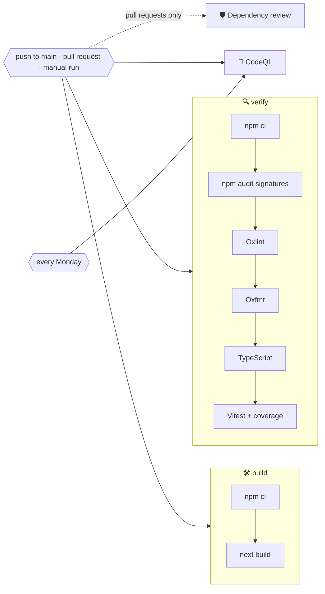

# 🚀 Deployment

Weather App is a regular Next.js server: it needs Node.js, the `OPENWEATHERMAP_API_KEY` variable and nothing else. There is no database and no build-time secret.

## 🔁 Continuous integration

`.github/workflows/ci.yml` runs on pushes to `main`, on pull requests and on demand.



| Job                    | Runs on                       | What it does                                                                                                                           |
| ---------------------- | ----------------------------- | -------------------------------------------------------------------------------------------------------------------------------------- |
| 🔍 `verify`            | every trigger                 | `npm ci`, `npm audit signatures`, Oxlint with GitHub annotations, Oxfmt, TypeScript, Vitest with coverage, coverage summary and report |
| 🛠️ `build`             | every trigger                 | The production build, which type-checks again and prerenders the flags, icons and manifest                                             |
| 🛡️ `dependency-review` | pull requests                 | Fails the pull request if it adds dependencies with high-severity vulnerabilities                                                      |
| 🔬 `analyze` (CodeQL)  | pushes, pull requests, weekly | Scans TypeScript and the workflow files with the `security-extended` queries                                                           |

- ⚡ `verify` and `build` run in parallel.
- 🛑 Pull request runs cancel superseded runs of the same branch.
- 🔐 The token is read-only and checkouts use `persist-credentials: false`.
- 🟢 Node.js is installed from `.nvmrc` and npm downloads are cached.
- 🔑 The build does not need the API key: every page that uses it is rendered on demand.

## ⚙️ One-time GitHub setup

1. Open **Settings → Code security** and enable **Private vulnerability reporting**, **Dependabot alerts** and **Code scanning** (CodeQL uploads its results there).
2. Optionally protect `main` and require the `verify` and `build` checks.

## ☁️ Hosting

### ▲ Vercel

1. Import the repository in Vercel; the Next.js preset needs no changes.
2. Add `OPENWEATHERMAP_API_KEY` under **Settings → Environment Variables** for Production and Preview.
3. Deploy. Every push to `main` deploys again, and pull requests get preview URLs.

### 🖥️ Any Node.js host

```bash
npm ci
npm run build
OPENWEATHERMAP_API_KEY=… npm start          # listens on port 3000, or PORT
```

Put a reverse proxy with TLS in front of it and let it set `X-Forwarded-For`, which the search endpoint's rate limiter uses to tell visitors apart.

## 🗃️ Caching in production

| Layer              | What is cached                                    | How long                                                             |
| ------------------ | ------------------------------------------------- | -------------------------------------------------------------------- |
| Next.js data cache | OpenWeatherMap responses, per URL and language    | 10 min weather, 30 min air quality, 7 days geocoding                 |
| Static output      | Flags, icons, manifest, app icons, social preview | Until the next build; `Cache-Control: immutable` for icons and flags |
| Browser            | Saved and recent places                           | Until cleared                                                        |

Pages themselves are rendered per request, because they depend on the URL, the cookies and a fresh CSP nonce. On a host with several instances, each keeps its own data cache unless you configure a shared [cache handler](https://nextjs.org/docs/app/api-reference/config/next-config-js/cacheHandlers).

## 🤖 Dependency updates

`.github/dependabot.yml` checks for updates every Monday:

- 📦 npm minor and patch updates are grouped into one pull request for production and one for development dependencies; major updates arrive separately;
- ⚙️ GitHub Actions updates are grouped into a single pull request;
- 📝 commit messages follow the project convention (`chore(deps): …`, `ci(deps): …`).

When `@meteocons/svg` is updated, run `npm run icons` and commit the changed icons.
