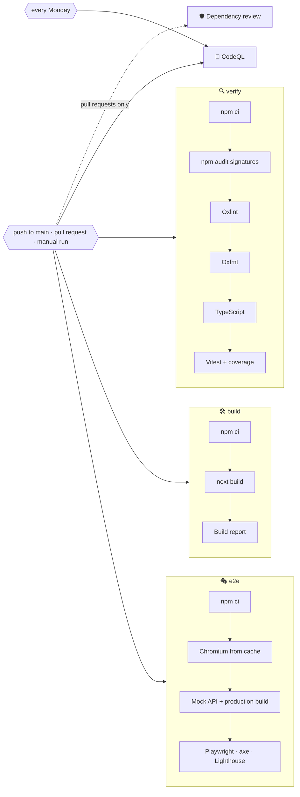

# 🚀 Deployment

Weather App is a regular Next.js server: it needs Node.js, the `OPENWEATHERMAP_API_KEY` variable and, on a custom domain, `SITE_URL`. There is no database and no build-time secret.

## 🔁 Continuous integration

`.github/workflows/ci.yml` runs on pushes to `main`, on pull requests and on demand.



| Job                    | Runs on                       | What it does                                                                                                                                                                        |
| ---------------------- | ----------------------------- | ----------------------------------------------------------------------------------------------------------------------------------------------------------------------------------- |
| 🔍 `verify`            | every trigger                 | `npm ci`, `npm audit signatures`, Oxlint with GitHub annotations, Oxfmt, TypeScript, Vitest with coverage, coverage summary and report                                              |
| 🛠️ `build`             | every trigger                 | The production build without an API key, then `scripts/build-report.mjs` checks the sitemap, robots, manifest, icons, flags, share images, proxy and headers and reports the bundle |
| 🎭 `e2e`               | every trigger                 | Chromium from a cache keyed by the Playwright version, a production build against the mock OpenWeatherMap API, Playwright on desktop and phone, axe and the Lighthouse budget       |
| 🛡️ `dependency-review` | pull requests                 | Fails the pull request if it adds dependencies with high-severity vulnerabilities                                                                                                   |
| 🔬 `analyze` (CodeQL)  | pushes, pull requests, weekly | Scans TypeScript and the workflow files with the `security-extended` queries                                                                                                        |

- ⚡ `verify`, `build` and `e2e` run in parallel.
- 🛑 Pull request runs cancel superseded runs of the same branch.
- 🔐 The token is read-only and checkouts use `persist-credentials: false`.
- 🟢 Node.js is installed from `.nvmrc` and npm downloads are cached.
- 🔑 The build does not need the API key: every page that uses it is rendered on demand.
- 📤 The Playwright report, with a Lighthouse report for every budgeted page, is uploaded as an artifact even when the tests fail.

The build report is written to the workflow summary:

```text
### 📦 Build output

271 prerendered routes, 265 flags, 8 languages.

| File | Size | Gzip |
| --- | ---: | ---: |
| `static/chunks/….js` | 229.0 kB | 71.7 kB |
| **JavaScript, 14 files** | | **209.3 kB** |
| **CSS, 3 files** | | **10.9 kB** |

✅ The sitemap, robots rules, manifest, icons, flags, share images, the proxy and the security headers are in place.
```

## ⚙️ One-time GitHub setup

1. Open **Settings → Code security** and enable **Private vulnerability reporting**, **Dependabot alerts** and **Code scanning** (CodeQL uploads its results there).
2. Optionally protect `main` and require the `verify`, `build` and `e2e` checks.

> [!TIP]
> The `e2e` job never needs a real API key: the mock server answers every request, so forks and Dependabot pull requests run the full suite too.

## ☁️ Hosting

### ▲ Vercel

1. Import the repository in Vercel; the Next.js preset needs no changes.
2. Add the environment variables under **Settings → Environment Variables** for Production and Preview:

   | Variable                 | Value                                                           |
   | ------------------------ | --------------------------------------------------------------- |
   | `OPENWEATHERMAP_API_KEY` | Your OpenWeatherMap key                                         |
   | `SITE_URL`               | Only for a custom domain, for example `https://weather.example` |

3. Deploy. Every push to `main` deploys again, and pull requests get preview URLs.

Without `SITE_URL` the production domain from `VERCEL_PROJECT_PRODUCTION_URL` is used for canonical links, the sitemap and share cards.

> [!NOTE]
> Preview deployments are kept out of search engines automatically: robots disallow everything and pages are marked `noindex`.

### 🖥️ Any Node.js host

```bash
npm ci
SITE_URL=https://weather.example npm run build
OPENWEATHERMAP_API_KEY=… npm start          # listens on port 3000, or PORT
```

Put a reverse proxy with TLS in front of it and let it set `X-Forwarded-For`, which the search endpoint's rate limiter uses to tell visitors apart.

> [!WARNING]
> Set `SITE_URL` before `npm run build`: the sitemap and robots rules are prerendered and keep the address known at build time.

## 🗃️ Caching in production

| Layer              | What is cached                                 | How long                                                       |
| ------------------ | ---------------------------------------------- | -------------------------------------------------------------- |
| Next.js data cache | OpenWeatherMap responses, per URL and language | 10 min weather, 30 min air quality, 7 days geocoding           |
| Static output      | Flags, icons, manifest, app icons, share cards | Until the next build; browsers keep icons and flags for a week |
| Browser            | Saved and recent places                        | Until cleared                                                  |

Pages themselves are rendered per request, because they depend on the URL, the cookies and a fresh CSP nonce. On a host with several instances, each keeps its own data cache unless you configure a shared [cache handler](https://nextjs.org/docs/app/api-reference/config/next-config-js/cacheHandlers).

## 🤖 Dependency updates

`.github/dependabot.yml` checks for updates every Monday:

- 📦 npm minor and patch updates are grouped into one pull request for production and one for development dependencies; major updates arrive separately;
- ⚙️ GitHub Actions updates are grouped into a single pull request;
- 📝 commit messages follow the project convention (`chore(deps): …`, `ci(deps): …`).

When `@meteocons/svg` is updated, run `npm run icons` and commit the changed icons.

## 🖐️ Checking a build locally

```bash
npm run check
npm run build
npm start
```

Open `http://localhost:3000`, which redirects to your browser's language, and check a forecast in a couple of languages (`/en?city=Tokyo`, `/uk?city=Kyiv`), an unknown page, `/sitemap.xml`, `/robots.txt` and a share card such as `/en/opengraph-image/card`.

`npm run test:e2e` does the same automatically against the mock OpenWeatherMap API, including accessibility and the Lighthouse budget, without spending any of your API calls.
