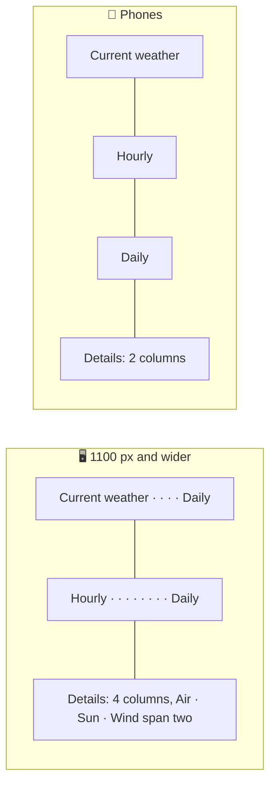

# 🎨 Design system

The interface is a set of translucent **glass** cards floating over a **sky** that matches the weather in the city you are looking at. It shares its language with the other apps in this portfolio: Montserrat, soft specular rims, rounded concentric shapes and spring motion.

## 💡 Principles

- 🌌 **The sky is the content's mood.** The background is not decoration chosen once; it is part of the forecast.
- 🫧 **Glass carries information, not chrome.** Every card is glass; the header, the footer and overlays use the same material, so the page reads as one surface.
- 🔢 **Numbers first, sentences second.** Each detail card leads with one big value and explains it in a short sentence underneath.
- 📏 **One scale per question.** Daily temperature bars share the week's scale, the gauge and the sun arc are drawn to scale, colours follow absolute temperatures.
- 🧘 **Calm by default.** Motion is slow and subtle and disappears completely when the system asks for less motion.

## 🧭 Layout



| Part            | Treatment                                                                                             |
| --------------- | ----------------------------------------------------------------------------------------------------- |
| 🔝 Header       | The brand, a capsule search field and two round glass buttons. The brand's name hides below 720 px    |
| ⭐ Saved places | A row of glass chips that scrolls sideways and fades out at the edge                                  |
| 🌤️ Current      | The largest card: place, local time, a 168 px icon and a light 7 rem temperature                      |
| 📅 Daily        | Stretches to the height of the current and hourly cards on wide screens                               |
| 📊 Details      | `auto-fill` grid with `grid-auto-flow: dense`; Air quality, Sun and Wind span two columns from 720 px |
| 🦶 Footer       | A glass bar with credits and social links                                                             |

The content is 76 rem wide with a fluid gutter of `clamp(1rem, 3vw, 1.5rem)`. The dashboard grid lives in `shared/styles/_dashboard.scss`, so the skeleton and the real dashboard always line up.

## 🌌 Skies

`conditionSky()` picks one of eight skies, and `Sky` renders a fixed layer with `data-sky` behind the page:

| Sky               | Light theme (top → bottom)         | Dark theme (top → bottom) | Texture         |
| ----------------- | ---------------------------------- | ------------------------- | --------------- |
| ☀️ `clear-day`    | `#3d8bf2` → `#cfe6ff`, sun glow    | `#0a2a5e` → `#2f73bd`     | none            |
| 🌙 `clear-night`  | `#4a5aa8` → `#c9cdeb`              | `#040817` → `#18245a`     | stars           |
| ⛅ `cloudy-day`   | `#7f97b5` → `#e6edf5`              | `#182334` → `#40536e`     | drifting clouds |
| ☁️ `cloudy-night` | `#56627e` → `#c7cdd9`              | `#080b12` → `#1f2738`     | faint stars     |
| 🌧️ `rain`         | `#5f7895` → `#d6e0ea`              | `#0b1522` → `#24384f`     | falling rain    |
| ⛈️ `storm`        | `#4f4a6e` → `#c6c2da`, violet glow | `#0c0a17` → `#2c2549`     | falling rain    |
| ❄️ `snow`         | `#9fb8d4` → `#f4f8fc`              | `#18222f` → `#41566f`     | falling snow    |
| 🌫️ `fog`          | `#96a1ad` → `#eceff2`              | `#121417` → `#31363d`     | drifting haze   |

Each sky is a three-stop gradient plus a large radial **glow** in its accent colour. The palettes are one Sass map in `shared/styles/_skies.scss`; `sky-colors()` turns it into `--sky-top`, `--sky-middle`, `--sky-bottom` and `--sky-glow` for both themes.

Textures are pure CSS gradients. Rain and snow move with `translate` on a layer taller than the screen, so the animation stays on the compositor; the glow drifts over 48 seconds. While a new city loads, the layout's base gradient shows and the new sky fades in.

## 🫧 Glass

The `glass()` mixin in `shared/styles/_mixins.scss` builds every surface from the same layers:

1. 🎨 **Tint**: `--glass-tint` (white at 58 % in light mode, deep navy at 40 % in dark mode).
2. 🌫️ **Backdrop**: `blur(22px) saturate(180 %)`, 32 px for overlays.
3. ✨ **Sheen**: a soft diagonal highlight on top of the tint.
4. 💍 **Rim**: a 1 px gradient ring drawn by `::before` with `mask-composite: exclude`, bright at the top left and shaded at the bottom right.
5. 🌒 **Depth**: an inset top highlight and a two-part shadow.

```scss
@use "@/shared/styles/mixins" as *;

.card {
  @include glass(var(--radius-lg), var(--glass-tint), var(--glass-blur));
}
```

Overlays (search suggestions, the location message, settings, the offline notice) use `--glass-tint-overlay`, which is almost opaque. Chromium does not blur the contents of other glass cards behind a glass overlay, so a nearly solid overlay is the only way to keep it readable everywhere.

> [!WARNING]
> `backdrop-filter` only sees what is painted inside its backdrop root. A sticky or `z-index`ed ancestor (the header used to be both) made the search field and its suggestions blur nothing but the header itself. Keep glass out of such containers, or give the surface a nearly opaque tint.

## 🔤 Typography

**Montserrat** is self-hosted through `@fontsource-variable/montserrat`: one variable file per script (Latin, Latin Extended, Cyrillic, Cyrillic Extended, Vietnamese), downloaded only when a character needs it and allowed by `font-src 'self'`.

| Role                | Size                          | Weight |
| ------------------- | ----------------------------- | ------ |
| Current temperature | `clamp(4rem, 15vw, 7rem)`     | 250    |
| City                | `clamp(1.5rem, 4vw, 2rem)`    | 700    |
| Detail values       | `clamp(1.6rem, 6vw, 2.1rem)`  | 500    |
| Card labels         | 0.75 rem, uppercase, +0.06 em | 600    |
| Body and notes      | 0.9–1 rem                     | 500    |

All digits are tabular (`font-variant-numeric: tabular-nums`), so the clock and the hourly row never jump.

## 🎛️ Design tokens

Tokens live in `shared/styles/_tokens.scss` as CSS custom properties, defined by three mixins: `shared`, `light` and `dark`. `<html data-theme>` is `system`, `light` or `dark`; `system` switches with `prefers-color-scheme`.

| Group          | Tokens                                                                                                                                                                                                                               |
| -------------- | ------------------------------------------------------------------------------------------------------------------------------------------------------------------------------------------------------------------------------------ |
| 🖋️ Text        | `--color-text`, `--color-text-secondary`, `--color-text-tertiary`                                                                                                                                                                    |
| 🎨 Accent      | `--color-accent`, `--color-accent-soft`, `--color-on-accent`, `--color-focus`                                                                                                                                                        |
| 🧱 Surfaces    | `--color-fill`, `--color-fill-strong`, `--color-separator`, `--track`, `--skeleton`, `--backdrop-base`                                                                                                                               |
| 🫧 Glass       | `--glass-tint`, `--glass-tint-strong`, `--glass-tint-overlay`, `--glass-solid`, `--glass-sheen`, `--glass-rim`, `--glass-rim-shade`, `--glass-highlight`, `--glass-shadow`, `--glass-saturate`, `--glass-blur`, `--glass-blur-thick` |
| 🌡️ Temperature | `--temperature-cold` … `--temperature-hot`                                                                                                                                                                                           |
| 🍃 Air quality | `--air-1` (good, green) … `--air-5` (very poor, violet)                                                                                                                                                                              |
| ⭕ Shape       | `--radius-sm` 12 px, `--radius-md` 16 px, `--radius-lg` 24 px, `--radius-full`                                                                                                                                                       |
| 🌊 Motion      | `--ease-out`, `--ease-spring`, `--duration-fast` 160 ms, `--duration-base` 280 ms, `--duration-slow` 600 ms                                                                                                                          |
| 📐 Layout      | `--layout-width` 76 rem, `--gutter`, `--header-height`                                                                                                                                                                               |

## 📈 Charts

Every chart is a few lines of SVG drawn on the server with attributes only (no inline styles), so they work under the strict Content Security Policy and cost no JavaScript:

- 🌡️ **Temperature bars** (`TemperatureRange`): a track and a range on the week's scale, filled by a gradient whose stops are pinned to −10 °C, 5 °C, 15 °C, 25 °C and 35 °C in user space. A cold week is blue-green, a hot one yellow-orange.
- 🧭 **Compass** (`WindCard`): 36 ticks, localized cardinal letters and an arrow rotated to where the wind blows.
- ⏲️ **Pressure gauge**: a half circle from 960 to 1060 hPa, filled with `pathLength="1"` and `stroke-dasharray`.
- 🌅 **Sun arc**: a cubic Bézier from sunrise to sunset, the travelled part drawn solid, and the sun placed on the curve.
- 🍃 **Air quality scale**: five segments in the index colours, the current one lit.

## 🌊 Motion

| Interaction           | Motion                                                                    |
| --------------------- | ------------------------------------------------------------------------- |
| Dashboard appears     | Cards rise 12 px and fade in, staggered by 60 ms                          |
| Sky changes           | The new sky fades in over 600 ms                                          |
| Buttons and chips     | Shrink to 94 % while pressed, on the spring curve                         |
| Saving a place        | The star pops in                                                          |
| Suggestions, messages | Scale in from 97 % and slide down 4 px                                    |
| Settings              | A popover that scales in from the top right, a sheet that rises on phones |

`--ease-spring` is a `linear()` curve sampled from a damped spring. With `prefers-reduced-motion: reduce` every animation and transition lasts 1 ms and the sky stands still.

## ♿ Accessibility

| Preference                                | Adaptation                                                         |
| ----------------------------------------- | ------------------------------------------------------------------ |
| 🐢 `prefers-reduced-motion: reduce`       | No animations, no moving sky                                       |
| 🌫️ `prefers-reduced-transparency: reduce` | Glass becomes solid (`--glass-solid`) without blur                 |
| 🌗 `prefers-color-scheme`                 | Followed live by the Auto theme                                    |
| 🖍️ `forced-colors: active`                | Glass gains a real border, selected options get a `Highlight` ring |

Secondary text is 74–78 % of the text colour and tertiary text 62–64 %, tuned to stay readable on glass over the brightest and the darkest skies.

## 🖼️ Iconography

- 🌦️ **Weather**: [Meteocons](https://bas.dev/work/meteocons) by Bas Milius, the filled style, served from `public/icons/weather/`.
- 🧭 **Interface**: inline SVG paths on a 24 px grid with 2 px round strokes in `shared/ui/Icon/icons.ts`, based on [Lucide](https://lucide.dev). They inherit `currentColor`.
- 🏳️ **Flags**: [country-flag-icons](https://gitlab.com/catamphetamine/country-flag-icons) in 3:2, prerendered by the `/flags/[code]` route.
- 📱 **App icon**: the partly cloudy Meteocon on a sky-blue rounded square (`app/icon.svg`); `apple-icon` and `opengraph-image` render PNGs from it with `next/og`.
