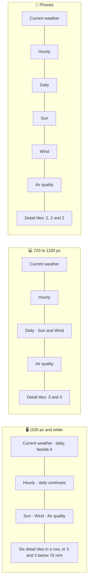

# 🎨 Design system

The interface is a set of translucent **glass** cards floating over a **sky** that matches the weather in the city you are looking at. It shares its language with the other apps in this portfolio: Montserrat, soft specular rims, rounded concentric shapes and spring motion.

## 💡 Principles

- 🌌 **The sky is the content's mood.** The background is not decoration chosen once; it is part of the forecast.
- 🫧 **Glass carries information, not chrome.** Every card is glass; the header, the footer and overlays use the same material, so the page reads as one surface.
- 🔢 **Numbers first, words second.** Each detail tile leads with one big value, rates it in one word and shows it on a bar.
- 📏 **One scale per question.** Daily temperature bars share the week's scale, the detail bars and the sun arc are drawn to scale, colours follow absolute temperatures.
- 🧘 **Calm by default.** Motion is slow and subtle and disappears completely when the system asks for less motion.

## 🧭 Layout



| Part              | Treatment                                                                                                                                                |
| ----------------- | -------------------------------------------------------------------------------------------------------------------------------------------------------- |
| 🔝 Header         | The logo and name, a capsule search field and two round glass buttons. The name hides below 720 px                                                       |
| ⭐ Saved places   | A row of glass chips that scrolls sideways and fades out at the edge                                                                                     |
| 🌤️ Current        | Place and local time, then the icon, a light temperature and the facts behind a separator; the description and the range share a line when there is room |
| 📅 Daily          | One line per day of the same height; on wide screens it spans the current weather and the hours                                                          |
| 🌅 Sun, wind, air | A row of three equal cards on wide screens; on tablets the sun and the wind sit beside the days                                                          |
| 📊 Details        | Six tiles with the same four rows (title, value, word, bar), so every row of tiles is full                                                               |
| 🦶 Footer         | A glass bar with the author, the version (a link to the changelog), the credits and the source code                                                      |

The content is 76 rem wide with a fluid gutter of `clamp(1rem, 3vw, 1.5rem)`. The dashboard is one grid with named areas in `shared/styles/_dashboard.scss`, so the skeleton and the real dashboard always line up. Cards in a row share its height, which is why each row pairs cards of a similar size: the daily forecast spreads its days evenly over the height of the current weather and the hours, and the sun, the wind and air quality fill one row. Six detail tiles divide evenly into rows of six, three or two, chosen by a container query on the dashboard. Each tile is a subgrid of four rows, so the titles, values, words and bars of one row line up even when a long word wraps. When a place has no visibility the five tiles still close every row: the last two share the second row of three, and on phones the last one is wide.

### 📱 Down to 320 px

Page breakpoints (`md` 720 px, `lg` 1100 px) decide the grid; **container queries** decide what happens inside a card, because the same card is narrow both on a phone and in the right column of a wide screen:

| Card     | Container        | Width        | Change                                                        |
| -------- | ---------------- | ------------ | ------------------------------------------------------------- |
| 📅 Daily | the list of days | under 18 rem | Narrower weekday, icon and temperature columns, 0.92 rem text |
| 💨 Wind  | the card content | any          | A compass of 36 % of the card, from 5.5 to 8.5 rem            |
| 🍃 Air   | the card         | under 17 rem | The pollutants in two rows of two instead of one row of four  |
| 🍃 Air   | the card         | from 40 rem  | The pollutants beside the summary instead of below it         |
| 📊 Tiles | the dashboard    | from 40 rem  | Three tiles in a row instead of two, six from 70 rem          |

Wind rows wrap their value under the label when a language needs it, and the hourly list scrolls inside its card.

> [!TIP]
> Check every layout change at 320 px in the longest languages, German and Ukrainian. The end-to-end tests fail when any page scrolls sideways at that width.

## 🌌 Skies

`conditionSky()` picks one of eight skies, and `Sky` renders a fixed layer with `data-sky` behind the page:

| Sky               | Light theme (top → bottom)         | Dark theme (top → bottom) | Texture         |
| ----------------- | ---------------------------------- | ------------------------- | --------------- |
| ☀️ `clear-day`    | `#3d8bf2` → `#cfe6ff`, sun glow    | `#0a2a5e` → `#2f73bd`     | none            |
| 🌙 `clear-night`  | `#4a5aa8` → `#c9cdeb`              | `#040817` → `#18245a`     | stars           |
| ⛅ `cloudy-day`   | `#7f97b5` → `#e6edf5`              | `#182334` → `#40536e`     | drifting clouds |
| ☁️ `cloudy-night` | `#56627e` → `#c7cdd9`              | `#080b12` → `#1f2738`     | faint stars     |
| 🌧️ `rain`         | `#5f7895` → `#d6e0ea`              | `#0b1522` → `#24384f`     | falling rain    |
| ⛈️ `storm`        | `#4f4a6e` → `#c6c2da`, violet glow | `#0c0a17` → `#2c2549`     | falling rain    |
| ❄️ `snow`         | `#9fb8d4` → `#f4f8fc`              | `#18222f` → `#41566f`     | falling snow    |
| 🌫️ `fog`          | `#96a1ad` → `#eceff2`              | `#121417` → `#31363d`     | drifting haze   |

Each sky is a three-stop gradient plus a large radial **glow** in its accent colour. The palettes are one Sass map in `shared/styles/_skies.scss`; `sky-colors()` turns it into `--sky-top`, `--sky-middle`, `--sky-bottom` and `--sky-glow` for both themes.

Textures are pure CSS gradients. Rain and snow move with `translate` on a layer taller than the screen, so the animation stays on the compositor; the glow drifts over 48 seconds. With reduced effects the sky stands still, see [Effects and performance](#-effects-and-performance). While a new city loads, the layout's base gradient shows and the new sky fades in.

## 🫧 Glass

The `glass()` mixin in `shared/styles/_mixins.scss` builds every surface from the same layers:

1. 🎨 **Tint**: `--glass-tint` (white at 58 % in light mode, deep navy at 40 % in dark mode).
2. 🌫️ **Backdrop**: `blur(22px) saturate(180 %)`, 32 px for overlays.
3. ✨ **Sheen**: a soft diagonal highlight on top of the tint.
4. 💍 **Rim**: a 1 px gradient ring drawn by `::before` with `mask-composite: exclude`, bright at the top left and shaded at the bottom right.
5. 🌒 **Depth**: an inset top highlight and a two-part shadow.

```scss
@use "@/shared/styles/mixins" as *;

.card {
  @include glass(var(--radius-lg), var(--glass-tint), var(--glass-blur));
}
```

Content surfaces (cards, the saved place chips, errors and the footer) pass `$content: true`, so they drop the blur for a denser `--glass-tint-content` when the effects are reduced. Small surfaces pass a lighter `$shadow`: the saved place chips use `--glass-shadow-small`, which fits inside the padding of their scrolling row instead of being cut off at its edges.

Overlays (search suggestions, the location message, settings, the offline notice) use `--glass-tint-overlay`, which is almost opaque. Chromium does not blur the contents of other glass cards behind a glass overlay, so a nearly solid overlay is the only way to keep it readable everywhere.

> [!WARNING]
> `backdrop-filter` only sees what is painted inside its backdrop root. A sticky or `z-index`ed ancestor (the header used to be both) made the search field and its suggestions blur nothing but the header itself. Keep glass out of such containers, or give the surface a nearly opaque tint.

## ⚡ Effects and performance

Every glass surface uses `backdrop-filter`, and the browser has to blur again whatever moves behind it. The animated sky and the animated Meteocons change pixels on every frame, so with the full effects all the glass on screen is recomputed sixty times a second even while nobody touches the page. Apple GPUs handle that easily; on many Windows and Android devices it makes scrolling and typing stutter. The **Effects** setting chooses how much of that work the page asks for:

| Level      | Sky                         | Weather icons | Glass                                        | Rims and shadows                    |
| ---------- | --------------------------- | ------------- | -------------------------------------------- | ----------------------------------- |
| ✨ Full    | Drifting glow, falling rain | Animated      | Blurred cards, controls and panels           | A masked gradient rim, deep shadows |
| 🍃 Reduced | Still                       | Still         | A denser tint, no `backdrop-filter` anywhere | A one-pixel ring, short shadows     |

**Auto** resolves to Full on Apple devices (`Mac`, `iPhone`, `iPad` in the `User-Agent`) and to Reduced everywhere else. The server resolves the level from the `weather-effects` cookie and the request's `User-Agent` and writes it to `<html data-effects>`, so the first byte already has the right sky and icons. The reduced tokens (`reduced-light` and `reduced-dark` in `shared/styles/_tokens.scss`) only change tints and shadows, and the `glass` mixin drops the blur and the masked rim, so every component follows without its own rules.

Two changes help both levels: the page background is a fixed layer instead of `background-attachment: fixed`, which made the browser repaint the page on every scroll step, and the entrance animations of the dashboard fill only `backwards`, so the four sections give their compositing layers back once they have appeared.

Measured in headless Chrome without a GPU, with the CPU slowed down four times, on a thunderstorm:

| Level      | Rendering work while idle | Rasterizing while idle | Scrolling |
| ---------- | ------------------------: | ---------------------: | --------: |
| ✨ Full    |                ≈1100 ms/s |              ≈220 ms/s |    40 fps |
| 🍃 Reduced |                   ≈1 ms/s |                 0 ms/s |    60 fps |

Removing the remaining blur, the masks and the leftover layers from Reduced cut the compositor's work while scrolling from 212 to 118 ms per second, and the page went from 17 composited layers to 7.

> [!TIP]
> Visitors on a fast Windows or Android device can pick **Full** in the settings; visitors on an older Mac can pick **Reduced**. The choice is a cookie, so it applies before the first paint on the next visit.

## 🔤 Typography

**Montserrat** is self-hosted through `@fontsource-variable/montserrat`: one variable file per script (Latin, Latin Extended, Cyrillic, Cyrillic Extended, Vietnamese), downloaded only when a character needs it and allowed by `font-src 'self'`.

| Role                | Size                          | Weight |
| ------------------- | ----------------------------- | ------ |
| Current temperature | `clamp(4rem, 15vw, 7rem)`     | 250    |
| City                | `clamp(1.5rem, 4vw, 2rem)`    | 700    |
| Detail values       | `clamp(1.6rem, 6vw, 2.1rem)`  | 500    |
| Card labels         | 0.75 rem, uppercase, +0.06 em | 600    |
| Body and notes      | 0.9-1 rem                     | 500    |

All digits are tabular (`font-variant-numeric: tabular-nums`), so the clock and the hourly row never jump.

## 🎛️ Design tokens

Tokens live in `shared/styles/_tokens.scss` as CSS custom properties, defined by three mixins: `shared`, `light` and `dark`. `<html data-theme>` is `system`, `light` or `dark`; `system` switches with `prefers-color-scheme`.

| Group          | Tokens                                                                                                                                                                                                                               |
| -------------- | ------------------------------------------------------------------------------------------------------------------------------------------------------------------------------------------------------------------------------------ |
| 🖋️ Text        | `--color-text`, `--color-text-secondary`, `--color-text-tertiary`                                                                                                                                                                    |
| 🎨 Accent      | `--color-accent`, `--color-accent-soft`, `--color-on-accent`, `--color-focus`                                                                                                                                                        |
| 🧱 Surfaces    | `--color-fill`, `--color-fill-strong`, `--color-separator`, `--track`, `--skeleton`, `--backdrop-base`                                                                                                                               |
| 🫧 Glass       | `--glass-tint`, `--glass-tint-strong`, `--glass-tint-overlay`, `--glass-solid`, `--glass-sheen`, `--glass-rim`, `--glass-rim-shade`, `--glass-highlight`, `--glass-shadow`, `--glass-saturate`, `--glass-blur`, `--glass-blur-thick` |
| 🌡️ Temperature | `--temperature-cold` … `--temperature-hot`                                                                                                                                                                                           |
| 🍃 Air quality | `--air-1` (good, green) … `--air-5` (very poor, violet)                                                                                                                                                                              |
| ⭕ Shape       | `--radius-sm` 12 px, `--radius-md` 16 px, `--radius-lg` 24 px, `--radius-full`                                                                                                                                                       |
| 🌊 Motion      | `--ease-out`, `--ease-spring`, `--duration-fast` 160 ms, `--duration-base` 280 ms, `--duration-slow` 600 ms                                                                                                                          |
| 📐 Layout      | `--layout-width` 76 rem, `--gutter`, `--header-height`                                                                                                                                                                               |

## 📈 Charts

Every chart is a few lines of SVG drawn on the server with attributes only (no inline styles), so they work under the strict Content Security Policy and cost no JavaScript:

- 🌡️ **Temperature bars** (`TemperatureRange`): a track and a range on the week's scale, filled by a gradient whose stops are pinned to −10 °C, 5 °C, 15 °C, 25 °C and 35 °C in user space. A cold week is blue-green, a hot one yellow-orange.
- 🧭 **Compass** (`WindCard`): 36 ticks, localized cardinal letters and an arrow rotated to where the wind blows.
- 📊 **Detail bars** (`Metric`): a track and a filled part as SVG rectangles with a width in percent, so they stretch with the tile; pressure runs from 960 to 1060 hPa, the dew point from −10 °C to 25 °C, visibility to 10 km and precipitation to 8 mm.
- 🌅 **Sun arc**: a wide, low cubic Bézier across the card from sunrise to sunset, the travelled part drawn solid, and the sun placed on the curve; the times sit under its ends.
- 🍃 **Air quality scale**: five segments in the index colours, the current one lit.

## 🌊 Motion

| Interaction           | Motion                                                                    |
| --------------------- | ------------------------------------------------------------------------- |
| Dashboard appears     | Cards rise 12 px and fade in, staggered by 60 ms                          |
| Sky changes           | The new sky fades in over 600 ms                                          |
| Buttons and chips     | Shrink to 94 % while pressed, on the spring curve                         |
| Saving a place        | The star pops in                                                          |
| Suggestions, messages | Scale in from 97 % and slide down 4 px                                    |
| Settings              | A popover that scales in from the top right, a sheet that rises on phones |

`--ease-spring` is a `linear()` curve sampled from a damped spring. With `prefers-reduced-motion: reduce` every animation and transition lasts 1 ms, the sky stands still and the weather icons switch to their still versions.

## ♿ Accessibility

| Preference                                | Adaptation                                                                                               |
| ----------------------------------------- | -------------------------------------------------------------------------------------------------------- |
| 🐢 `prefers-reduced-motion: reduce`       | No animations, no moving sky, still weather icons                                                        |
| 🌫️ `prefers-reduced-transparency: reduce` | Glass becomes solid (`--glass-solid`) without blur                                                       |
| 🔆 `prefers-contrast: more`               | Glass becomes solid with an outline, secondary text and separators get stronger (`more-contrast` tokens) |
| 🌗 `prefers-color-scheme`                 | Followed live by the Auto theme                                                                          |
| 🖍️ `forced-colors: active`                | Glass gains a real border, selected options get a `Highlight` ring                                       |

Secondary text is 74-78 % of the text colour and tertiary text 62-64 %, tuned to stay readable on glass over the brightest and the darkest skies. See [Accessibility](./accessibility.md) for how contrast is tested.

## 🖼️ Iconography

- 🌦️ **Weather**: [Meteocons](https://bas.dev/work/meteocons) by Bas Milius, the filled style. The animated set is served from `public/icons/weather/`, the still set from `public/icons/weather-static/` for reduced effects and reduced motion (through a `<picture>` source with `prefers-reduced-motion: reduce`).
- 🧭 **Interface**: inline SVG paths on a 24 px grid with 2 px round strokes in `shared/ui/Icon/icons.ts`, based on [Lucide](https://lucide.dev). They inherit `currentColor`.
- 🏳️ **Flags**: [country-flag-icons](https://gitlab.com/catamphetamine/country-flag-icons) in 3:2, prerendered by the `/flags/[code]` route.
- 📱 **App icon**: a white cloud in front of a yellow sun on a sky-blue gradient square with rounded corners (28 %) and a soft top sheen (`app/icon.svg`). The header draws it inline with `shared/ui/Logo`; `apple-icon` and the share card of every language render PNGs from the file with `next/og`.

> [!NOTE]
> Share cards cannot use the interface font: `next/og` does not read WOFF2. They load Montserrat 600 and 800 as WOFF from `src/shared/assets/fonts`, see [SEO](./seo.md#️-share-cards).
