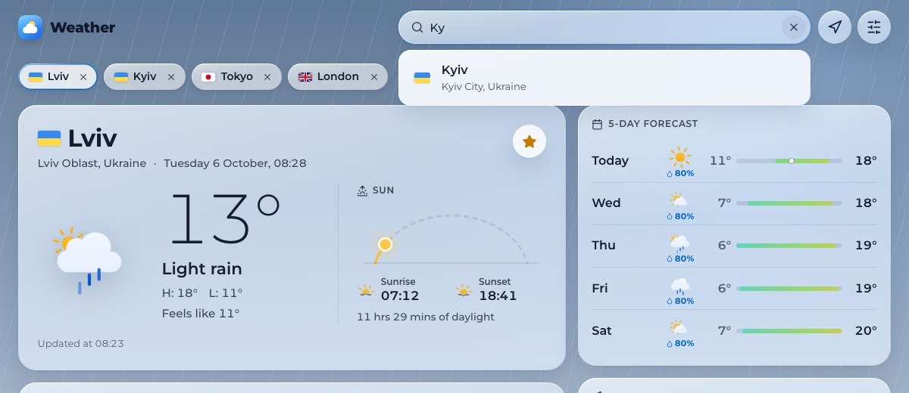
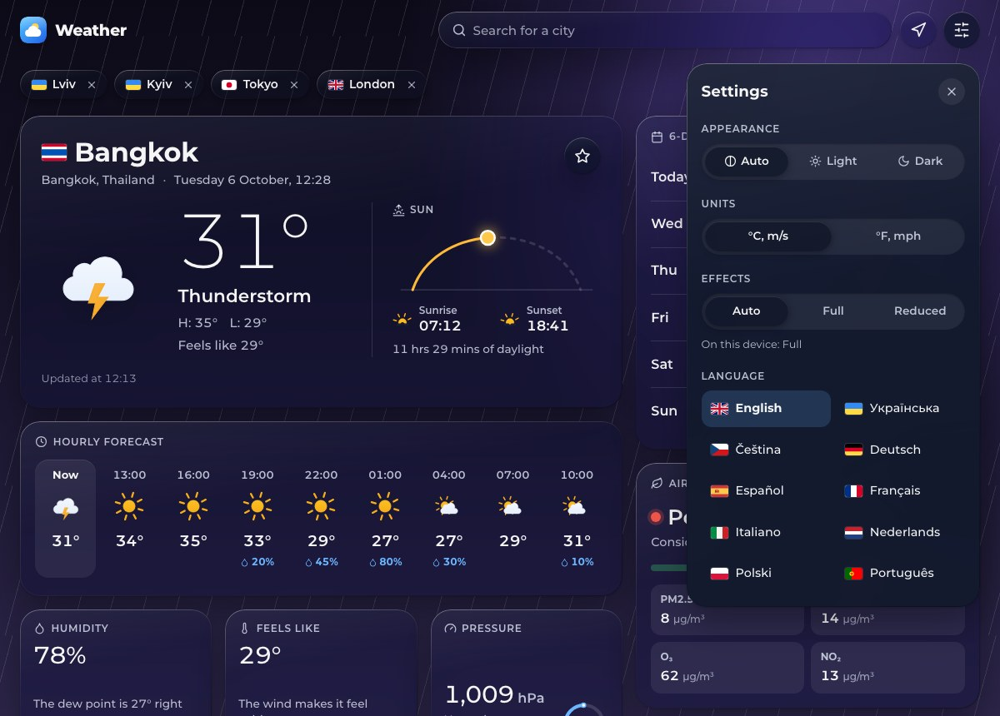

# ✨ Features

## 🌤️ Current weather

The first card answers "what is it like outside?":

- 📍 **Place**: the city in the interface language when OpenWeatherMap knows a local name (`Львів`, `Lemberg`), its region and country, and the country's flag.
- 🕰️ **Local time**: the date and time **of the city**, not of your device, updated every minute.
- 🌡️ **Temperature** with a Meteocon for the condition, by day or by night, and the description from OpenWeatherMap in your language.
- ↕️ **High and low** of today, stretched to include the current temperature (shown while the forecast still covers today), and the apparent temperature.
- 🔄 **Updated at**: the time of the observation, in the city's time zone.
- ⭐ **Save**: pins the city to the saved places row.

## 🌌 Living sky

The page background follows the weather in the city you are looking at:

| Sky             | Conditions                                   | Extras                   |
| --------------- | -------------------------------------------- | ------------------------ |
| ☀️ Clear day    | Clear sky and few clouds by day              | A warm sun glow          |
| 🌙 Clear night  | Clear sky and few clouds at night            | Stars                    |
| ⛅ Cloudy day   | Scattered, broken and overcast clouds by day | Drifting soft clouds     |
| ☁️ Cloudy night | The same at night                            | Faint stars              |
| 🌧️ Rain         | Drizzle and rain                             | Falling rain             |
| ⛈️ Storm        | Thunderstorms, squalls and tornadoes         | Rain under a violet glow |
| ❄️ Snow         | Snow and sleet                               | Falling snow             |
| 🌫️ Fog          | Mist, smoke, haze, dust, sand, fog and ash   | Slow bands of haze       |

Each sky has a light and a dark palette, so the theme you choose is respected. With reduced motion or reduced effects the sky and the weather icons stand still.

## 🕒 Hourly forecast

**Now** followed by the next eight three-hour steps (24 hours), each with the local time, a day or night icon, the temperature and, from 10 %, the chance of precipitation. The row scrolls sideways on narrow screens, with a swipe or with the arrow keys once it has focus.

## 📅 Daily forecast

Up to seven days with the weekday (**Today** for the first one), an icon, the chance of precipitation and a temperature bar. On a free key the week is built from the three-hour forecast and has five or six days. All bars share one scale from the coldest night to the warmest afternoon of the week, and the gradient is pinned to absolute temperatures: blue below freezing, green for mild days, orange for heat. Today's bar marks the current temperature with a dot.

## 📊 Details

The current weather card also follows the sun: sunrise, sunset, the length of the day and the sun's position on its arc, beside the temperature on larger screens and below it on phones. The detail tiles are compact and share one grid, and air quality and wind sit next to the daily forecast.

| Card             | Shows                                                                                                         |
| ---------------- | ------------------------------------------------------------------------------------------------------------- |
| 🍃 Air quality   | The European index from 1 (good) to 5 (very poor), advice, a coloured scale, PM2.5, PM10, O₃ and NO₂ in µg/m³ |
| 💨 Wind          | Speed, gusts and direction in degrees and compass points, with a compass arrow                                |
| 💧 Humidity      | Relative humidity and the dew point                                                                           |
| 🌡️ Feels like    | The apparent temperature and why it differs: wind makes it colder, humidity warmer                            |
| 🧭 Pressure      | Pressure in hPa or inHg on a gauge, rated low, normal or high                                                 |
| 👁️ Visibility    | Distance in km or mi, rated clear, hazy or poor                                                               |
| ☔ Precipitation | Rain and snow of the last hour in mm or in                                                                    |
| ☁️ Cloud cover   | The share of the sky covered by clouds, from clear skies to overcast                                          |

## 🔎 Search

- ⌨️ Type two letters to get up to five suggestions, with flags, regions and country names in your language. Local names work too: `Київ`, `Lemberg`.
- ⬆️⬇️ Move through suggestions with the arrow keys, open one with <kbd>Enter</kbd>, close the list with <kbd>Esc</kbd> and clear the field with a second <kbd>Esc</kbd>.
- ↩️ Pressing <kbd>Enter</kbd> without picking a suggestion opens the best match for the text (`/en?city=…`).
- 🕘 An empty field lists your five most recent places, which can be cleared.
- 🧩 Without JavaScript the field is a plain form that still opens `/en?city=…`.

## 📍 My location

The arrow button asks the browser for your position, rounds it to about a kilometre and opens the forecast there. A blocked permission or a failure is explained next to the button for a few seconds.

## ⭐ Saved places

The star in the current weather card saves the city. Saved places appear as chips above the forecast, named in the language of the page; the open one is outlined, and the cross removes a place. A city counts as saved once, whether it came from a search, a link or **Use my location**: places of one country closer than 25 km that share a name in any language are the same place. Saved places are stored in this browser only and stay in sync between tabs.

> [!NOTE]
> Up to 12 places can be saved. With a full list the star is unavailable and says _Saved places are full. Remove one to save Lviv_, instead of silently doing nothing.

## ⚙️ Settings

The sliders button opens a panel (a bottom sheet on phones):

| Setting       | Options                                                                                           |
| ------------- | ------------------------------------------------------------------------------------------------- |
| 🌗 Appearance | Auto (follows the system), Light, Dark. The page switches at once                                 |
| 📏 Units      | °C, m/s, hPa, km, mm or °F, mph, inHg, mi, in                                                     |
| ✨ Effects    | Auto (says which level this device gets), Full, Reduced. The page switches at once                |
| 🌍 Language   | English, Українська, Čeština, Deutsch, Español, Français, Italiano, Nederlands, Polski, Português |

**Full** keeps the moving sky and the animated weather icons. **Reduced** stills them and draws the cards without blur, which is much lighter for the graphics of many Windows and Android devices. **Auto** picks Full on Apple devices and Reduced everywhere else. See [Effects and performance](./design.md#-effects-and-performance) for the numbers.

Theme, units and effects are saved in cookies, so the server renders the next page in the right theme, units and effects without a flash. Each language is a link to the same place in that language (`/en?city=Kyiv` → `/uk?city=Kyiv`), and the choice is remembered for addresses without a language. On the first visit the language follows your browser.

> [!TIP]
> The theme switches the moment you choose it, before the server has saved it, so even a slow connection never shows the old colours.

## 🔗 Shareable addresses

| Address                   | Opens                                                    |
| ------------------------- | -------------------------------------------------------- |
| `/`                       | Redirects to your language, for example `/en`            |
| `/en`                     | Lviv in English                                          |
| `/de?city=Tokyo`          | The best match for a name, in German                     |
| `/uk?lat=49.84&lon=24.03` | Exact coordinates, rounded to two decimals, in Ukrainian |
| `/?city=Tokyo`            | Redirects to `/{your language}?city=Tokyo`               |

Invalid coordinates or an unknown name show **City not found** with a link back to the forecast; an unknown address shows **Page not found** in the language of the address.

> [!NOTE]
> The theme and units of the person who opens a link are their own; only the place and the language travel with the address.

## 🚦 States

| State           | What you see                                                                                        |
| --------------- | --------------------------------------------------------------------------------------------------- |
| ⏳ Loading      | A skeleton of the dashboard while a new place loads; the previous page stays during setting changes |
| 🔎 Not found    | An explanation and a link back to the forecast                                                      |
| 🔑 Key problems | Missing or rejected key, with what to do                                                            |
| 🚥 Rate limited | A request to try again in a minute, with **Try again**                                              |
| 📡 Unavailable  | The service or the network failed, with **Try again**                                               |
| 📴 Offline      | A notice at the bottom; navigation and settings retry automatically when you are back online        |
| 🧭 Missing page | **Page not found** with status 404, in the language of the address                                  |
| 💥 Crash        | **Something went wrong** with **Try again** and an error reference to quote in a bug report         |

## ♿ Accessibility

- 🧭 Landmarks for the header, search, saved places, main content and footer, a **Skip to the forecast** link and one `h1` per page (the city).
- 🗣️ The search is an ARIA combobox with an announced number of suggestions; loading, errors and the offline notice are live regions.
- 🔢 Charts are decorative and their numbers are also in the text, for example "from 6° to 18°" for each day.
- 🎯 Every control is reachable with the keyboard and shows a focus ring; radio groups power the segmented controls.
- 🐢 `prefers-reduced-motion` stops the sky, the weather icons and every transition, `prefers-reduced-transparency` and `prefers-contrast: more` make the glass solid, and `forced-colors` adds real borders and highlights.
- 📱 The layout fits a 320 px screen without scrolling sideways, in every language.

The details and how they are tested are in [Accessibility](./accessibility.md).
