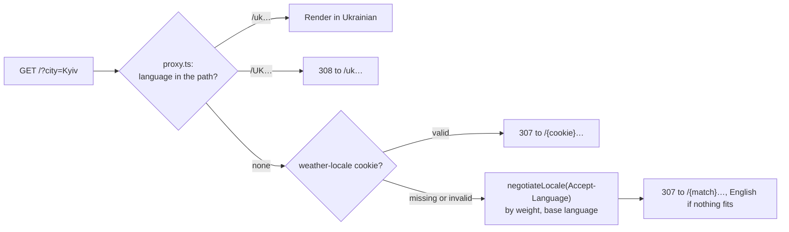
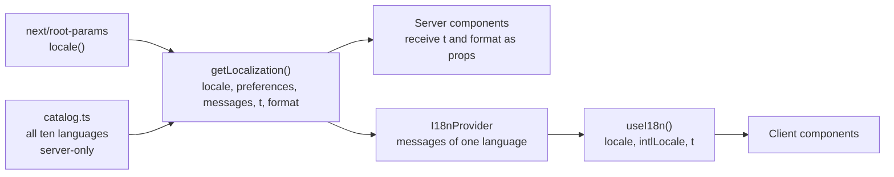

# 🌍 Localization

The interface speaks ten languages: 🇬🇧 English, 🇺🇦 Ukrainian, 🇨🇿 Czech, 🇩🇪 German, 🇪🇸 Spanish, 🇫🇷 French, 🇮🇹 Italian, 🇳🇱 Dutch, 🇵🇱 Polish and 🇵🇹 Portuguese. Weather descriptions, place names, country names, numbers, units, dates and times follow the chosen language too.

## 🔗 One address per language

Every page lives under its language: `/en`, `/uk?city=Kyiv`, `/pl?lat=50.06&lon=19.94`. The address alone decides the language of the page, so a link always opens in the language it was shared in, search engines can index every version, and the server never has to guess.



`negotiateLocale()` in `features/i18n/model/locales.ts` sorts the browser's languages by their `q` weight, reduces tags to the base language (`uk-UA` → `uk`) and takes the first supported one. The redirect keeps the rest of the address and the query, and sends `Vary: Accept-Language, Cookie` so caches keep one answer per language.

The languages in the settings are links to the same address in another language (`switchLocale()` swaps the first segment and keeps the query). Clicking one also writes the `weather-locale` cookie in the browser, so the next visit to an address without a language opens the chosen one.

> [!NOTE]
> Opening a shared `/de?city=Berlin` link shows German but does not change your saved language; only choosing a language in the settings does.

## 📚 Messages

Messages are flat objects in `features/i18n/model/messages/`, one file per language:

```ts
export const en = {
  "current.feelsLike": "Feels like {value}",
  "daily.title": "{count}-day forecast",
} satisfies Record<string, string>;

export type MessageKey = keyof typeof en;
export type Messages = Readonly<Record<MessageKey, string>>;
```

- 🇬🇧 `en.ts` defines the keys. Every other file is typed as `Messages`, so a missing or extra key fails the type check.
- 🧩 `{name}` placeholders are filled by `createTranslator(messages)(key, params)`; unknown placeholders are left as they are.
- ✅ `messages.test.ts` checks that every language has exactly the English keys, the same placeholders and no empty texts.
- 🔤 Keys are grouped by area: `app`, `search`, `locate`, `settings`, `places`, `current`, `hourly`, `daily`, `wind`, `direction`, `humidity`, `dewPoint`, `pressure`, `visibility`, `precipitation`, `clouds`, `sun`, `air`, `error`, `notFound`, `offline`, `footer`, `loading`.

## 🖥️ Server and client



- 🗄️ `catalog.ts` imports every language and is marked `server-only`, so the browser never downloads all ten.
- 📦 The layout passes only the current language's messages to `I18nProvider`, about 6 kB.
- 🧠 Server components get `t` and `format` from `getLocalization()`, which reads the language of the route with `locale()` from `next/root-params`; client components call `useI18n()`.
- 🧭 The global 404 page lives outside `[locale]`, so `getRequestLocalization()` takes the language from the `x-weather-locale` header the proxy adds, then from the cookie and `Accept-Language`.
- 🔎 `/api/places` receives the language as `lang`, because route handlers have no route language.

## 🔢 Formatting

`createFormatter(intlLocale, units)` in `shared/lib/format.ts` wraps `Intl`:

| Function      | Example (`uk-UA`)                      |
| ------------- | -------------------------------------- |
| `temperature` | `13°`, `-3°`                           |
| `speed`       | `5 м/с`                                |
| `distance`    | `3,2 км`                               |
| `pressure`    | `1 009` (the unit comes from messages) |
| `percent`     | `78%`                                  |
| `time`        | `17:00`                                |
| `weekday`     | `пт`                                   |
| `date`        | `пʼятниця, 3 жовтня`                   |
| `duration`    | `11 год 29 хв`                         |
| `country`     | `Україна`                              |
| `sentence`    | `Легкий дощ`                           |

Each app language has a regional formatting locale in `LOCALE_INFO`: `en-GB`, `uk-UA`, `cs-CZ`, `de-DE`, `es-ES`, `fr-FR`, `it-IT`, `nl-NL`, `pl-PL` and `pt-PT`. English therefore uses a 24-hour clock and day-month dates, and Portuguese follows Portugal.

No message needs plural forms: counts are either in fixed phrases (`Suggestions: 3`) or handled by `Intl` units (`11 hrs 29 mins`).

## 🌦️ Weather texts

OpenWeatherMap translates condition descriptions when it receives `lang`; the app sends the code OpenWeatherMap expects for the interface language (`openWeather` in `LOCALE_INFO`, which is `cz` for Czech) and capitalizes the result with the locale's rules. Geocoding returns `local_names`, so places appear as `Львів` or `Lemberg` when such a name exists.

## ➕ Adding a language

1. Add the code to `LOCALES` and its details to `LOCALE_INFO` in `features/i18n/model/locales.ts`:

   ```ts
   sv: { name: "Svenska", intl: "sv-SE", flag: "SE", openGraph: "sv_SE", openWeather: "sv" },
   ```

2. Copy `messages/en.ts` to `messages/sv.ts`, type it as `Messages` and translate every value. Keep the `{placeholders}`.
3. Register it in `catalog.ts` and in the list in `messages/messages.test.ts`.
4. Check the [language code OpenWeatherMap expects](https://openweathermap.org/current#multi) and put it into `openWeather`. It is usually the same two letters, but not always: Czech is `cz`.
5. Run `npm run check` and look at the app with the new language selected, on a phone too: long words are the usual reason for a broken layout.

The new language automatically gets its own addresses, `hreflang` links, a sitemap entry and a share card. `generateStaticParams()` in the layout and the share card reads the same list.

> [!IMPORTANT]
> The share cards are drawn with Montserrat in the Latin, Latin Extended and Cyrillic subsets. A language with another script (Greek, Arabic, Hebrew…) needs its subset in `src/shared/assets/fonts` and in `features/seo/og/assets.ts`, or its card shows empty boxes.

> [!TIP]
> Run `npx playwright test e2e/accessibility.spec.ts` with a page in the new language added to the reflow list, so a long word that breaks the layout at 320 px fails a test.
