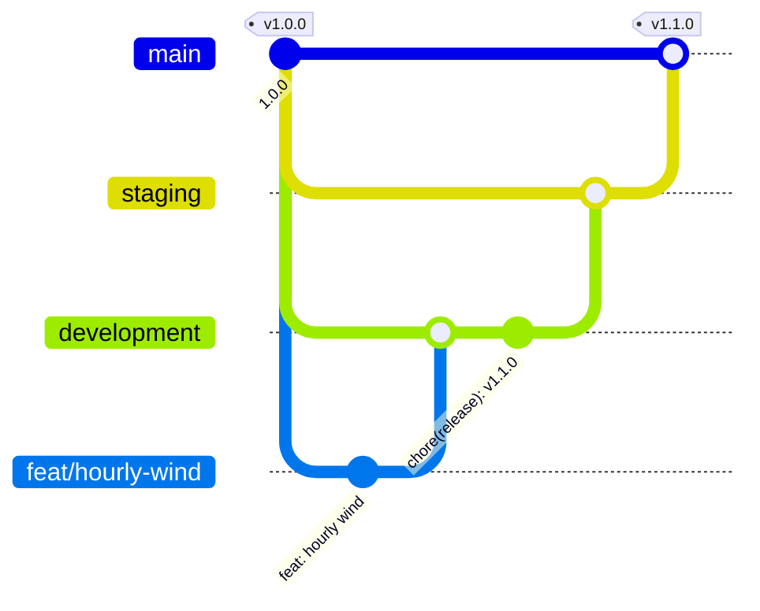

# 🏷️ Releases

Weather uses [Semantic Versioning](https://semver.org/spec/v2.0.0.html). The version lives in `package.json`, the footer of the app shows it with a link to the changelog, and every release is described in [CHANGELOG.md](../CHANGELOG.md) in the [Keep a Changelog](https://keepachangelog.com/en/1.1.0/) format. The current version is **1.0.0**.

## 🔢 Version numbers

| Part     | Changes when                                                                                                                                                   | Example |
| -------- | -------------------------------------------------------------------------------------------------------------------------------------------------------------- | ------- |
| 🔴 Major | Something visitors or deployments rely on stops working: a removed feature, an address or cookie that changes its meaning, a new required environment variable | `2.0.0` |
| 🟡 Minor | A new feature or a visible improvement that keeps everything else working                                                                                      | `1.1.0` |
| 🟢 Patch | Bug fixes, security fixes, dependency updates and text corrections                                                                                             | `1.0.1` |

> [!TIP]
> The commit types point at the next version: a `feat` calls for a minor release, a `fix` for a patch, and a `!` after the type (`feat!: …`) or a `BREAKING CHANGE:` footer for a major one.

## 🌿 Branches



| Branch               | Purpose                                                          | Deploys to              |
| -------------------- | ---------------------------------------------------------------- | ----------------------- |
| 🌱 `development`     | Finished work comes together here; every pull request targets it | 🧪 Development preview  |
| 🧪 `staging`         | The next release, checked as a whole before it reaches people    | 🔍 Staging              |
| 🚀 `main`            | Released code only; every merge into it is tagged with a version | 🌍 Production           |
| 🌿 `feat/…`, `fix/…` | One change, branched from `development`                          | 👀 Pull request preview |

## 🚀 Cutting a release

1. 🔢 On `development`, pick the version from the notes under **Unreleased** and bump it without a tag:

   ```bash
   npm version minor --no-git-tag-version
   ```

2. 📝 In `CHANGELOG.md`, rename **Unreleased** to `## [1.1.0] - YYYY-MM-DD`, add an empty **Unreleased** section above it and update the comparison links at the bottom.
3. 📬 Commit as `chore(release): v1.1.0` and open a pull request from `development` into `staging`. Check the staging deployment in a few languages, on a phone and in both themes.
4. 🔀 Open a pull request from `staging` into `main` and merge it.
5. 🏷️ Tag the merge on `main` and push the tag:

   ```bash
   git switch main && git pull
   git tag -a v1.1.0 -m "v1.1.0"
   git push origin v1.1.0
   ```

6. 🤖 The release workflow publishes the GitHub release with the notes of that version from `CHANGELOG.md`.

> [!IMPORTANT]
> The tag must equal `v` plus the version in `package.json` and point at a commit on `main`. Otherwise the release workflow fails before anything is published.

## 🩹 Hotfixes

An urgent fix does not wait for `development`:

1. 🌿 Branch `fix/…` from `main`, fix the problem and bump the patch version (`npm version patch --no-git-tag-version`).
2. 📝 Add the `## [1.0.1] - YYYY-MM-DD` section to `CHANGELOG.md`.
3. 🔀 Merge the pull request into `main`, then tag and push `v1.0.1` as above.
4. ↩️ Merge `main` back into `staging` and `development`, so the fix is not lost in the next release.

## 🤖 Automation

| Where                                  | What it checks                                                                                                                        |
| -------------------------------------- | ------------------------------------------------------------------------------------------------------------------------------------- |
| 🔍 CI on every push and pull request   | `scripts/release-notes.mjs` finds a non-empty `CHANGELOG.md` section for the version in `package.json`                                |
| 🏷️ `release.yml` on every `v*.*.*` tag | The tag matches `package.json`, the commit is on `main`, then `gh release create` publishes the release with the notes of the version |
| 🤖 Dependabot every Monday             | Opens its pull requests against `development`, so updates ship with the next release                                                  |

Run `node scripts/release-notes.mjs` locally to see the notes of the current version, or `node scripts/release-notes.mjs v1.1.0` to check a tag before pushing it.

## ⚙️ One-time GitHub setup

1. Create the `development` and `staging` branches from `main` and make `development` the default branch, so new pull requests target it.
2. Protect `main` and `staging` under **Settings → Rules**: require a pull request and the `verify`, `build` and `e2e` checks, and block force pushes.
3. Optionally add a tag rule for `v*`, so only maintainers can create releases.

## ☁️ Environments

On Vercel, the production branch is `main`. `staging` and `development` get preview deployments with stable branch addresses, and every pull request gets its own preview.

| Environment    | Branch        | Search engines                 |
| -------------- | ------------- | ------------------------------ |
| 🌍 Production  | `main`        | ✅ Indexed                     |
| 🔍 Staging     | `staging`     | 🚫 `noindex`, robots block all |
| 🧪 Development | `development` | 🚫 `noindex`, robots block all |

> [!NOTE]
> `isIndexable()` in `shared/lib/site.ts` allows indexing only when `APP_ENV` (Docker) or `VERCEL_ENV` (Vercel) is `production` or neither is set, so staging and previews never compete with the real site in search results. Give each environment its own `OPENWEATHERMAP_API_KEY` if you want to keep their quotas apart.

The same three environments also run in Docker: `docker/development.yaml`, `docker/staging.yaml` and `docker/production.yaml` set `APP_ENV` and read `.env`, `.env.staging` and `.env.production`, see [Deployment](./deployment.md#-docker).
