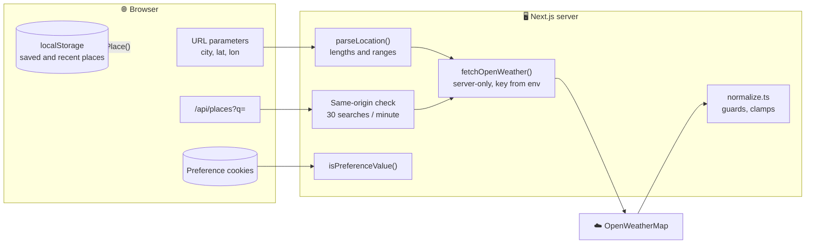

# 🛡️ Security

Weather App is a small Next.js server with no accounts and no database. Its valuable asset is the **OpenWeatherMap API key**, and its attack surface is what reaches the server: URL parameters, the search endpoint, the preference cookies, and the data returned by OpenWeatherMap.

To report a vulnerability, follow the [security policy](../.github/SECURITY.md).

## 🗺️ Trust boundaries

## 🔑 The API key

- 🖥️ The key is read from `process.env.OPENWEATHERMAP_API_KEY` in `shared/api/openWeather.ts`, which imports `server-only`. Importing it from a client component breaks the build, and the variable has no `NEXT_PUBLIC_` prefix, so Next.js never inlines it into JavaScript.
- 🚫 The browser never calls OpenWeatherMap; responses are rendered on the server or passed through `/api/places` without the key.
- 🗃️ Responses are cached for 10 minutes (weather), 30 minutes (air quality) and 7 days (geocoding), which keeps the number of calls per key low even with many visitors.

## 🧱 Content Security Policy

`src/proxy.ts` runs for every page request, creates a random **nonce** and sends this policy (built by `shared/lib/contentSecurityPolicy.ts`):

| Directive                                               | Value                               | Why                                                                          |
| ------------------------------------------------------- | ----------------------------------- | ---------------------------------------------------------------------------- |
| `default-src`                                           | `'self'`                            | 🔒 Nothing is loaded from other origins                                      |
| `script-src`                                            | `'self' 'nonce-…' 'strict-dynamic'` | 🚫 Only Next.js's own scripts, which receive the nonce automatically         |
| `style-src`                                             | `'self' 'nonce-…'`                  | 🎨 Only the bundled stylesheets and Next.js's nonced styles                  |
| `style-src-attr`                                        | `'unsafe-inline'`                   | 🧩 React's streaming briefly hides SVG fragments with `style="display:none"` |
| `img-src`                                               | `'self' data: blob:`                | 🖼️ Meteocons, flags and icons are served by the app itself                   |
| `font-src`, `connect-src`, `manifest-src`, `worker-src` | `'self'`                            | 📡 Only the app's own files and endpoints                                    |
| `object-src`                                            | `'none'`                            | 🧩 No plugins                                                                |
| `base-uri`, `form-action`                               | `'self'`                            | 🧭 No base tag or form hijacking                                             |
| `frame-ancestors`                                       | `'none'`                            | 🪟 The app cannot be framed                                                  |

The development server additionally allows `'unsafe-eval'` and inline styles, which React's debugging and hot reload need. Nonces require dynamic rendering, which the page uses anyway because it depends on cookies and the URL.

The app has no inline scripts of its own: the theme is known on the server from the cookie, so there is no theme script to allow.

## 📨 Other headers

`next.config.ts` adds to every response:

| Header                       | Value                                                                 |
| ---------------------------- | --------------------------------------------------------------------- |
| `X-Content-Type-Options`     | `nosniff`                                                             |
| `X-Frame-Options`            | `DENY`                                                                |
| `Referrer-Policy`            | `strict-origin-when-cross-origin`                                     |
| `Permissions-Policy`         | camera, microphone, payment and USB off; geolocation for the app only |
| `Cross-Origin-Opener-Policy` | `same-origin`                                                         |
| `Strict-Transport-Security`  | Two years, in production                                              |

Icons and flags additionally get `Content-Security-Policy: default-src 'none'; style-src 'unsafe-inline'; sandbox`, so an SVG opened on its own cannot run anything, and a year-long immutable cache. API responses are sent with `Cache-Control: no-store`. The `X-Powered-By` header is off.

## 🔎 The search endpoint

`GET /api/places?q=` is the only endpoint that reaches OpenWeatherMap on demand, so it is guarded:

- 🌐 Requests whose `Sec-Fetch-Site` is not `same-origin` are rejected with `403`, so other websites cannot use the app as a free geocoding proxy from their visitors' browsers.
- 📏 Queries shorter than two characters return no places without a call; longer than 80 characters are rejected with `400`.
- 🚦 Each client address may search 30 times a minute (`createRateLimiter()`), then gets `429` with `Retry-After: 60`. The address comes from `X-Forwarded-For` or `X-Real-IP`, so run the app behind a proxy that sets them; the limiter keeps at most 10,000 addresses in memory and forgets expired ones.
- 🧼 Results go through `parsePlace()` before they are returned.

## ✅ Input validation

| Input                  | Protection                                                                                       |
| ---------------------- | ------------------------------------------------------------------------------------------------ |
| 🔗 `?lat=&lon=`        | Must both be numbers within ±90 and ±180; rounded to two decimals                                |
| 🔗 `?city=`            | Trimmed, at most 80 characters; sent to OpenWeatherMap as a URL parameter, never interpolated    |
| 🍪 Cookies             | Each value is checked against its allowed list; anything else falls back to the default          |
| ⚡ Server action       | `savePreference()` checks the name with `Object.hasOwn` and the value with `isPreferenceValue()` |
| ☁️ OpenWeatherMap JSON | Read field by field with type guards; numbers must be finite, ranges are clamped                 |
| 💾 `localStorage`      | Parsed with `JSON.parse` in a `try`, every entry rebuilt by `parsePlace()`, lists capped         |

React escapes every string it renders, and the app never uses `dangerouslySetInnerHTML`. City names and condition descriptions from OpenWeatherMap are therefore plain text.

## 🍪 Cookies and privacy

- The three preference cookies are `HttpOnly`, `SameSite=Lax`, `Secure` in production and contain only a theme, a unit system or a language code.
- Saved and recent places never leave the browser.
- Your position is rounded to about a kilometre before it becomes part of the URL, and the app asks for it only when you press **Use my location**.
- There are no analytics, no third-party scripts and no requests from the browser to other origins.

## 🔗 Supply chain and CI

- 📦 `npm ci` installs exactly what `package-lock.json` describes, and `npm audit signatures` verifies registry signatures and provenance.
- 🛡️ The dependency review action blocks pull requests that add dependencies with high-severity advisories.
- 🔬 CodeQL scans the TypeScript code and the workflows with the `security-extended` queries on every push, pull request and weekly.
- 🔐 Workflows run with a read-only token and do not persist credentials.
- 🤖 Dependabot proposes npm and GitHub Actions updates every Monday.

## ☑️ Checklist for contributors

- [ ] Keep anything that needs the API key in server-only modules.
- [ ] Route every new input through a parser that checks types, lengths and ranges.
- [ ] Do not add requests from the browser to other origins; serve assets from the app.
- [ ] Never render HTML strings; keep `script-src` free of `'unsafe-inline'`.
