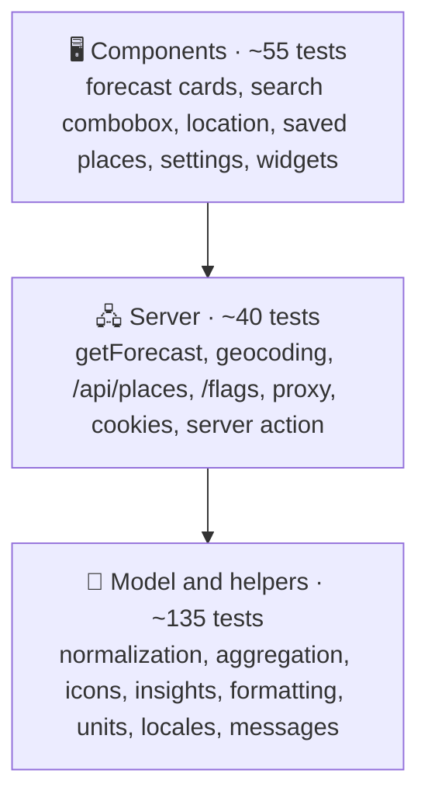

# 🧪 Testing

## 🧰 Stack

| Tool                            | Role                                              |
| ------------------------------- | ------------------------------------------------- |
| ⚡ Vitest 5                     | Test runner, configured in `vitest.config.ts`     |
| 🌐 jsdom 30                     | Browser-like environment                          |
| 🐙 Testing Library + user-event | Rendering components and driving them like a user |
| 🧩 jest-dom                     | Readable DOM assertions such as `toBeChecked()`   |
| 📊 `@vitest/coverage-v8`        | Coverage reports and thresholds                   |

## ▶️ Running tests

| Command                 | Mode                                    |
| ----------------------- | --------------------------------------- |
| `npm test`              | Watch mode                              |
| `npm run test:run`      | Single run                              |
| `npm run test:coverage` | Single run with coverage and thresholds |

The HTML coverage report is written to `coverage/index.html`.

## 🔺 Shape of the suite

Most behaviour is pinned down by fast tests of pure functions; component tests render with the real messages and assert on what a user sees.

## 📁 Where tests live

Tests sit next to the code they cover as `*.test.ts(x)`:

| Area              | Files                                                                                                              | Covers                                                                                                    |
| ----------------- | ------------------------------------------------------------------------------------------------------------------ | --------------------------------------------------------------------------------------------------------- |
| 🌦️ Forecast model | `normalize`, `getForecast`, `conditions`, `insights`                                                               | Parsing every endpoint, defaults and clamping, the free-key fallback, failures, every icon on disk        |
| 🖼️ Forecast UI    | `ForecastViews.test.tsx`, `ForecastStates.test.tsx`                                                                | Every card in metric and imperial, polar days, missing data, the live clock, errors, retry, skeleton      |
| 📍 Places         | `place`, `location`, `geocoding`, `storedPlaces`, `PlacesUi.test.tsx`                                              | URL parsing, local names, deduplication, saved and recent places, the combobox, geolocation outcomes      |
| ⚙️ Preferences    | `preferences`, `server`, `actions`, `PreferencesUi.test.tsx`                                                       | Cookie reading and fallbacks, the server action's validation and cookie options, settings, offline notice |
| 🌍 i18n           | `locales`, `translate`, `messages`, `useI18n`                                                                      | `Accept-Language` matching, placeholders, identical keys and placeholders in all eight languages          |
| 🚀 App            | `api/places/route`, `flags/[code]/route`, `proxy`                                                                  | Same-origin check, limits, failure statuses, rate limiting, flags, the nonce-based policy and matcher     |
| 🧰 Shared         | `format`, `units`, `time`, `guards`, `rateLimit`, `storedList`, `contentSecurityPolicy`, `openWeather`, `SharedUi` | Intl formatting, conversions, local dates, storage failures, HTTP status mapping, primitives              |
| 🧩 Widgets        | `Widgets.test.tsx`                                                                                                 | Header, footer and the async Forecast widget with a mocked model                                          |

## 🧪 Fixtures and helpers

| Helper                                                                                     | File                   | Purpose                                                                     |
| ------------------------------------------------------------------------------------------ | ---------------------- | --------------------------------------------------------------------------- |
| `weatherResponse`, `forecastResponse`, `dailyResponse`, `airResponse`, `geocodingResponse` | `src/test/fixtures.ts` | Realistic OpenWeatherMap responses for Lviv at a fixed moment               |
| `forecast`, `view(overrides)`                                                              | `src/test/fixtures.ts` | A normalized forecast and the `{ forecast, t, format }` props of every card |
| `NOW`, `OFFSET`, `SUNRISE`, `SUNSET`                                                       | `src/test/fixtures.ts` | The fixed moment (3 October 2025, 17:00 in Lviv) and its time zone          |
| `jsonResponse(body, status)`                                                               | `src/test/fixtures.ts` | A `Response` for stubbed `fetch` calls                                      |
| `renderWithI18n(ui, locale)`                                                               | `src/test/render.tsx`  | Renders inside `I18nProvider` with English or Ukrainian and returns `user`  |

`src/test/setup.ts` adds the jest-dom matchers, replaces `next/link` with a plain anchor, and unmounts components and clears `localStorage` after every test. `server-only` is aliased to an empty module, so server code can be tested directly.

## 🧭 Testing Next.js code

- 🖧 **Server functions** (`getForecast`, geocoding) are tested by stubbing the global `fetch` with `vi.stubGlobal` and routing by `url.pathname`. `vi.stubEnv` sets or removes the API key; `vi.resetModules()` gives each test a fresh module state.
- 🍪 **Request APIs** (`cookies()`, `headers()`) are mocked with `vi.mock("next/headers")`.
- 🧭 **Navigation** is mocked with `vi.mock("next/navigation")` and assertions on `router.push()`.
- 🛣️ **Route handlers** are called with a `NextRequest` and their `Response` is inspected.
- ⏳ **Async server components** are awaited as functions and the returned element is rendered: `render(await Forecast({ query }))`.

## 📐 Conventions

- 🎯 Query by role and accessible name (`getByRole("button", { name: "Save Lviv" })`). If something is hard to find this way, it is probably hard to use with a screen reader.
- 🖱️ Drive the UI with `userEvent`; use fake timers only for time-based behaviour, such as the clock or a message that hides itself.
- 👀 Assert on what the user sees, the URL pushed or the data stored, never on component state.
- 🔢 Keep logic that a component needs in a plain module (`insights.ts`, `normalize.ts`) so it can be tested without rendering.
- 🧪 Type every mock: `vi.fn<(href: string) => void>()`. Oxlint requires it.
- 🌐 Browser-only behaviour (the glass, the sky animations, the real Content Security Policy) is checked in Chromium with the production build.

## 📊 Coverage thresholds

`npm run test:coverage` fails when coverage drops below 90 % for statements, branches, functions or lines. Next.js special files that only compose other components (`layout`, `page`, `error`, `global-error`, `not-found`, `manifest` and the image routes) are excluded; everything they render is tested.

The CI pipeline runs the same command and publishes a coverage table on the workflow summary page.
