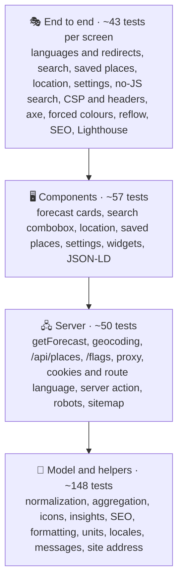
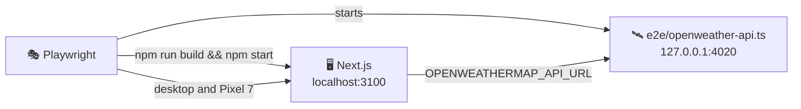

# 🧪 Testing

## 🧰 Stack

| Tool                            | Role                                                       |
| ------------------------------- | ---------------------------------------------------------- |
| ⚡ Vitest 5                     | Unit and component tests, configured in `vitest.config.ts` |
| 🌐 jsdom 30                     | Browser-like environment for component tests               |
| 🐙 Testing Library + user-event | Rendering components and driving them like a user          |
| 🧩 jest-dom                     | Readable DOM assertions such as `toBeChecked()`            |
| 📊 `@vitest/coverage-v8`        | Coverage reports and thresholds                            |
| 🎭 Playwright                   | End-to-end tests in Chromium on desktop and phone screens  |
| ♿ axe-core                     | Accessibility checks inside the end-to-end tests           |
| 🚦 Lighthouse                   | Performance, accessibility, best practices and SEO budget  |

## ▶️ Running tests

| Command                 | Mode                                                                                         |
| ----------------------- | -------------------------------------------------------------------------------------------- |
| `npm test`              | 👁️ Unit tests in watch mode                                                                  |
| `npm run test:run`      | 🧪 Unit tests, single run                                                                    |
| `npm run test:coverage` | 📊 Unit tests with coverage and thresholds                                                   |
| `npm run test:e2e`      | 🎭 Production build against the mock OpenWeatherMap API, then Playwright, axe and Lighthouse |

The HTML coverage report is written to `coverage/index.html`, the Playwright report to `playwright-report/`; open the latter with `npx playwright show-report`.

> [!IMPORTANT]
> Install the browser for the end-to-end tests once with `npx playwright install chromium`.

## 🔺 Shape of the suite

Most behaviour is pinned down by fast tests of pure functions; component tests render with the real messages and assert on what a user sees. The end-to-end tests check what only a real browser and server can: redirects, status codes, the nonce-based Content Security Policy, streaming, layout on a phone and the accessibility of the finished pages.

## 📁 Where unit tests live

Tests sit next to the code they cover as `*.test.ts(x)`:

| Area              | Files                                                                                                                      | Covers                                                                                                        |
| ----------------- | -------------------------------------------------------------------------------------------------------------------------- | ------------------------------------------------------------------------------------------------------------- |
| 🌦️ Forecast model | `normalize`, `getForecast`, `conditions`, `insights`                                                                       | Parsing every endpoint, defaults and clamping, the free-key fallback and when it is remembered, every icon    |
| 🖼️ Forecast UI    | `ForecastViews.test.tsx`, `ForecastStates.test.tsx`                                                                        | Every card in metric and imperial, polar days, missing data, the live clock, errors with references, skeleton |
| 📍 Places         | `place`, `location`, `geocoding`, `storedPlaces`, `PlacesUi.test.tsx`                                                      | URL parsing, links in every language, canonical queries, local names, the combobox, geolocation outcomes      |
| ⚙️ Preferences    | `preferences`, `server`, `actions`, `PreferencesUi.test.tsx`                                                               | Cookies, the language of the route and of a request, the server action, language links, offline notice        |
| 🔎 SEO            | `features/seo/**/*.test.ts(x)`                                                                                             | Titles, alternates, Open Graph and X fields, escaped JSON-LD, the place schema                                |
| 🌍 i18n           | `locales`, `translate`, `messages`, `useI18n`                                                                              | `Accept-Language` matching, path helpers, placeholders, identical keys in all eight languages                 |
| 🚀 App            | `api/places/route`, `flags/[code]/route`, `robots`, `sitemap`, `proxy`                                                     | Same-origin check, limits, rate limiting, flags, robots rules, the sitemap, redirects and the nonce policy    |
| 🧰 Shared         | `format`, `units`, `time`, `guards`, `rateLimit`, `storedList`, `contentSecurityPolicy`, `site`, `openWeather`, `SharedUi` | Intl formatting, conversions, storage failures, the public address, the API address, primitives               |
| 🧩 Widgets        | `Widgets.test.tsx`                                                                                                         | Header, footer and the async Forecast widget with its structured data                                         |

## 🧪 Fixtures and helpers

| Helper                                                                                     | File                   | Purpose                                                                     |
| ------------------------------------------------------------------------------------------ | ---------------------- | --------------------------------------------------------------------------- |
| `weatherResponse`, `forecastResponse`, `dailyResponse`, `airResponse`, `geocodingResponse` | `src/test/fixtures.ts` | Realistic OpenWeatherMap responses for Lviv at a fixed moment               |
| `forecast`, `view(overrides)`                                                              | `src/test/fixtures.ts` | A normalized forecast and the `{ forecast, t, format }` props of every card |
| `NOW`, `OFFSET`, `SUNRISE`, `SUNSET`                                                       | `src/test/fixtures.ts` | The fixed moment (3 October 2025, 17:00 in Lviv) and its time zone          |
| `jsonResponse(body, status)`                                                               | `src/test/fixtures.ts` | A `Response` for stubbed `fetch` calls                                      |
| `renderWithI18n(ui, locale)`                                                               | `src/test/render.tsx`  | Renders inside `I18nProvider` with English or Ukrainian and returns `user`  |

`src/test/setup.ts` adds the jest-dom matchers, replaces `next/link` with a plain anchor, and unmounts components and clears `localStorage` after every test. `vitest.config.ts` only collects `src/**/*.test.{ts,tsx}` and aliases `server-only` to an empty module, so server code can be tested directly.

## 🧭 Testing Next.js code

- 🖧 **Server functions** (`getForecast`, geocoding) are tested by stubbing the global `fetch` with `vi.stubGlobal` and routing by `url.pathname`. `vi.stubEnv` sets or removes the API key; `vi.resetModules()` gives each test a fresh module state.
- 🍪 **Request APIs** (`cookies()`, `headers()`) are mocked with `vi.mock("next/headers")`.
- 🌍 **The route language** comes from `next/root-params`, mocked with `vi.mock("next/root-params")`.
- 🧭 **Navigation** is mocked with `vi.mock("next/navigation")`: `router.push()`, `usePathname()` and `useSearchParams()`.
- 🛣️ **Route handlers and the proxy** are called with a `NextRequest`, and their `Response` is inspected, including redirects and the request headers the proxy adds.
- ⏳ **Async server components** are awaited as functions and the returned element is rendered: `render(await Forecast({ query }))`.

> [!NOTE]
> `next/root-params` only works inside a Next.js build. Every test that reaches `getLocalization()` mocks it, or mocks `features/preferences/model/server` as a whole.

## 🎭 End-to-end tests

`playwright.config.ts` starts two servers before the tests:

1. 🛰️ **The mock OpenWeatherMap API** (`e2e/openweather-api.ts`), a dependency-free Node server that answers the six endpoints the app uses. It knows four cities with different skies: Lviv (rain), Kyiv (clear), Reykjavik (snow) and Bangkok (thunderstorm), with local names in several languages and descriptions in English, Ukrainian and German. Times are relative to the moment of the request, so the clock, the hours and the days always make sense. Like a free key, it answers `401` for the daily forecast unless `E2E_DAILY_PLAN=1`.
2. 🖥️ **A production build** of the app with `OPENWEATHERMAP_API_URL` pointing at the mock and `SITE_URL` at the test server, served on port 3100.

> [!TIP]
> Locally both servers are reused when they are already running, so after the first run a repeated `npx playwright test e2e/accessibility.spec.ts` takes seconds. Start them yourself with the environment from `playwright.config.ts` to keep them between runs.

| Spec                       | Checks                                                                                                                                                                                         |
| -------------------------- | ---------------------------------------------------------------------------------------------------------------------------------------------------------------------------------------------- |
| 🌦️ `forecast.spec.ts`      | The default city, the week from the free forecast, keyboard search, an unknown city, saved places, geolocation, units and theme after a reload, switching languages, search without JavaScript |
| 🧭 `routing.spec.ts`       | Redirect to the browser language, the saved language winning, the city kept, lowercase languages, translated 404s with status 404, broken coordinates                                          |
| ♿ `accessibility.spec.ts` | axe on six pages in five languages, the dark theme, the settings and the suggestions, the skip link, forced colours mode and no sideways scrolling at 320 px                                   |
| 🛡️ `security.spec.ts`      | No console errors or CSP violations while searching, saving settings and opening three languages, a fresh nonce per request, every header, the search API guards                               |
| 🔎 `seo.spec.ts`           | Titles, canonical and `hreflang` links, `og:locale`, the canonical of the default city, JSON-LD, `noindex` for failures, the sitemap, robots, share images, manifest                           |
| 🚦 `lighthouse.spec.ts`    | The Lighthouse budget below                                                                                                                                                                    |

Every spec except SEO and Lighthouse runs twice: in **Desktop Chrome** and on a **Pixel 7** screen. The accessibility checks run with reduced motion, so transitions never catch axe halfway.

> [!NOTE]
> Without JavaScript the streamed forecast stays in a hidden template, because React needs a small script to move it into place. The no-JS test therefore checks what has to work without scripts: the search form submits to `/{language}?city=…` and the new page has the right title.

### 🚦 Lighthouse budget

`lighthouse.spec.ts` runs after the other projects, one page at a time, in a fresh Chromium:

| Page                    | Form factor | Performance | Accessibility | Best practices | SEO | Page weight |
| ----------------------- | ----------- | ----------: | ------------: | -------------: | --: | ----------: |
| 🌧️ `/en`                | 🖥️ Desktop  |      ≥ 0.90 |             1 |              1 |   1 |    ≤ 450 KB |
| 🌧️ `/en`                | 📱 Mobile   |      ≥ 0.80 |             1 |              1 |   1 |    ≤ 450 KB |
| ☀️ `/uk?city=Kyiv`      | 🖥️ Desktop  |      ≥ 0.90 |             1 |              1 |   1 |    ≤ 450 KB |
| ❄️ `/de?city=Reykjavik` | 📱 Mobile   |      ≥ 0.80 |             1 |              1 |   1 |    ≤ 450 KB |

Every weighted audit of the accessibility and best practices categories must pass as well. Each run attaches the full Lighthouse HTML report to its test in the Playwright report, so a failed budget can be inspected in CI.

## 📐 Conventions

- 🎯 Query by role and accessible name (`getByRole("button", { name: "Save Lviv" })`). If something is hard to find this way, it is probably hard to use with a screen reader.
- 🖱️ Drive the UI with `userEvent`; use fake timers only for time-based behaviour, such as the clock or a message that hides itself.
- 👀 Assert on what the user sees, the URL pushed or the data stored, never on component state.
- 🔢 Keep logic that a component needs in a plain module (`insights.ts`, `normalize.ts`, `seo.ts`) so it can be tested without rendering.
- 🧪 Type every mock: `vi.fn<(href: string) => void>()`. Oxlint requires it.
- 🌐 Never call the real OpenWeatherMap API: stub `fetch` in unit tests and use the mock server in end-to-end tests.

> [!CAUTION]
> Oxfmt rewrites escape sequences inside `String.raw` templates. Write expected strings with escapes such as `<` as ordinary string literals with a doubled backslash (`'\\u003c'`), or the test silently compares against the unescaped text.

## 📊 Coverage

`npm run test:coverage` fails below these thresholds:

| Metric        | Threshold |
| ------------- | --------: |
| 📄 Statements |      95 % |
| 🔀 Branches   |      95 % |
| 🧩 Functions  |      95 % |
| 📏 Lines      |      95 % |

The suite currently covers about 99.7 % of statements and 96 % of branches. Next.js special files that only compose other components (`layout`, `page`, `error`, `global-error`, `global-not-found`, `manifest` and the image routes) and the share card assets in `src/features/seo/og` are excluded, because the end-to-end tests and the production build cover them. CI publishes a coverage summary and uploads the HTML coverage and Playwright reports.
