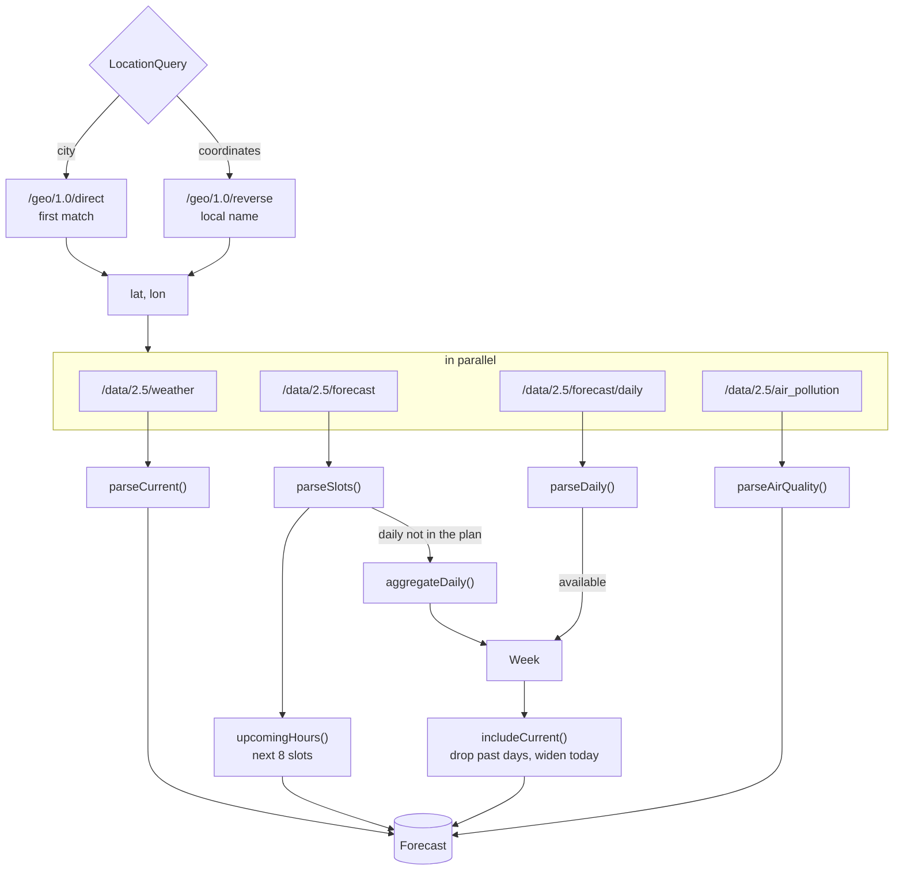

# 🌦️ Weather data

All weather comes from [OpenWeatherMap](https://openweathermap.org). The browser never talks to it: the Next.js server calls the API with the key from `OPENWEATHERMAP_API_KEY`, normalizes the answers into the types in `features/forecast/model/types.ts` and renders them.

> [!NOTE]
> `OPENWEATHERMAP_API_URL` replaces `https://api.openweathermap.org` with another host that speaks the same API. The end-to-end tests point it at `e2e/openweather-api.ts`, a small mock with four cities.

## 📡 Endpoints

| Endpoint                   | Used for                                       | Parameters                           | Cached for |
| -------------------------- | ---------------------------------------------- | ------------------------------------ | ---------- |
| `/geo/1.0/direct`          | Search suggestions and `?city=` lookups        | `q`, `limit` (5, or 1 for lookups)   | 7 days     |
| `/geo/1.0/reverse`         | The local name of `?lat=&lon=`                 | `lat`, `lon`, `limit=1`              | 7 days     |
| `/data/2.5/weather`        | Current conditions, sunrise, sunset, time zone | `lat`, `lon`, `units=metric`, `lang` | 10 minutes |
| `/data/2.5/forecast`       | 5 days in three-hour steps                     | `lat`, `lon`, `units=metric`, `lang` | 10 minutes |
| `/data/2.5/forecast/daily` | Seven days, if the key's plan includes it      | the same, `cnt=7`                    | 10 minutes |
| `/data/2.5/air_pollution`  | Air quality index and pollutants               | `lat`, `lon`                         | 30 minutes |

Every call goes through `fetchOpenWeather()` in `shared/api/openWeather.ts`:

- ⏱️ It aborts after **8 seconds**.
- 🗃️ It uses `fetch(url, { next: { revalidate } })`, so responses are stored in the Next.js data cache and shared by every visitor and every unit system. Identical requests within one render are deduplicated.
- 🚦 It turns HTTP statuses into failures: `401` → `invalid-key`, `404` → `not-found`, `429` → `rate-limited`, anything else or a network error → `unavailable`. Without a key it returns `missing-key` without calling the service.
- 🔒 It is marked `server-only`, so importing it from a client component fails the build.

## 🔄 Assembling a forecast

`getForecast(query, locale)` in `features/forecast/model/getForecast.ts` returns either `{ ok: true, forecast }` or `{ ok: false, failure }`:

| Situation                                                    | Result                                                       |
| ------------------------------------------------------------ | ------------------------------------------------------------ |
| The city name has no match                                   | `not-found`                                                  |
| Geocoding fails                                              | That failure, for example `rate-limited`                     |
| Reverse geocoding finds nothing (the open sea)               | The place from the weather response, or the coordinates only |
| The current weather fails                                    | That failure; nothing can be shown without it                |
| The current weather has no temperature, humidity or pressure | `unavailable`                                                |
| The 3-hour forecast fails                                    | An empty hourly row; the week comes from the daily endpoint  |
| The daily forecast fails                                     | The week is built from the 3-hour slots                      |
| Air pollution fails                                          | **No air quality data for this place**                       |

The place keeps the coordinates from the query, rounded to two decimals (about a kilometre), so the saved place, the URL and the cache key always agree.

## 🗓️ Daily forecast on a free key

The daily endpoint belongs to paid plans and answers `401` on a free key. In that case:

1. `aggregateDaily()` groups the 40 three-hour slots by **local** date (using the city's offset).
2. Each day gets the lowest `temp_min`, the highest `temp_max` and the highest precipitation chance of its slots.
3. The icon is the **most severe** condition between 06:00 and 21:00 local time (storm > snow > rain > drizzle > atmosphere > clouds > clear), so a sunny day with an afternoon storm shows the storm.
4. Today is always kept; later days need at least four slots, which drops the incomplete sixth day. A free key therefore shows five or six days.
5. The `401` is remembered for an hour in the server process, so the paid endpoint is not called on every request. It is remembered only when the current weather succeeded with the same key: a key that is rejected everywhere (new, mistyped, revoked) must not block the daily forecast for an hour after it is fixed.

> [!TIP]
> To see the five or six aggregated days locally, use a free key, or run the mock server, which answers the daily endpoint with `401` unless `E2E_DAILY_PLAN=1`.

`includeCurrent()` then removes days that have already ended in the city and widens today's range to include the current temperature.

## 🧼 Normalization

Responses are treated as untrusted input. `normalize.ts` reads them with the guards in `shared/lib/guards.ts` (`readNumber`, `readString`, `readRecord`, `readArray`), which accept only finite numbers, non-empty strings and plain objects:

- 🧱 Required fields missing → the entry is skipped (slots, days) or the response is rejected (current weather).
- 📐 Ranges are clamped: humidity and cloud cover to 0–100 %, precipitation chances to 0–1, wind speed to ≥ 0.
- 🌓 Day or night comes from the icon suffix (`10d`, `10n`); without an icon, from sunrise and sunset or the slot's `pod`.
- 🌅 A sunrise or sunset of `0` (polar day or night) becomes `null`, and the Sun card explains it.
- 🌍 Places go through `parsePlace()`: names up to 80 characters, `[A-Z]{2}` country codes, valid latitudes and longitudes.

## 🌍 Languages

`lang` is the interface language, so condition descriptions arrive translated (`легкий дощ`, `Leichter Regen`) and are capitalized with `toLocaleUpperCase()`. Place names prefer `local_names[locale]` from geocoding (`Львів`, `Lemberg`) and fall back to the international name. Because the language is part of the request URL, every language is cached separately.

## 🖼️ Condition icons

`conditionIcon()` maps [OpenWeatherMap condition codes](https://openweathermap.org/weather-conditions) to [Meteocons](https://bas.dev/work/meteocons) by code and time of day:

| Codes   | Group        | Icons                                                                                        |
| ------- | ------------ | -------------------------------------------------------------------------------------------- |
| 200–232 | Thunderstorm | `thunderstorms-{day,night}`, `thunderstorms`, `thunderstorms-extreme`, with `-rain` variants |
| 300–321 | Drizzle      | `partly-cloudy-{day,night}-drizzle`, `drizzle`, `extreme-drizzle`                            |
| 500–531 | Rain         | `partly-cloudy-{day,night}-rain`, `rain`, `extreme-rain`, `sleet` for freezing rain          |
| 600–622 | Snow         | `partly-cloudy-{day,night}-snow`, `snow`, `extreme-snow`, `sleet`                            |
| 701–781 | Atmosphere   | `mist`, `smoke`, `haze-*`, `dust-*`, `fog-*`, `smoke-particles`, `wind`, `tornado`           |
| 800     | Clear        | `clear-day`, `clear-night`                                                                   |
| 801–804 | Clouds       | `mostly-clear-*`, `partly-cloudy-*`, `overcast-*`, `overcast`                                |

Unknown codes fall back to `not-available`. A test checks that every code, by day and by night, maps to a file that exists in `public/icons/weather/`.

> [!WARNING]
> Icons are committed copies. After updating `@meteocons/svg`, run `npm run icons`, or the app keeps serving the old files.

The icons are copied from the `@meteocons/svg` package by `npm run icons` (`scripts/sync-icons.mjs`) and committed, so the app serves them itself. To use a new icon, add its name to the list in the script and run it.

`conditionSky()` maps the same codes to the eight [skies](./design.md#-skies).

## 📏 Units

| Quantity      | Stored as | Metric display | Imperial display |
| ------------- | --------- | -------------- | ---------------- |
| Temperature   | °C        | `13°`          | `56°`            |
| Wind          | m/s       | `5 m/s`        | `10 mph`         |
| Pressure      | hPa       | `1,009 hPa`    | `29.8 inHg`      |
| Visibility    | m         | `3.2 km`       | `2 mi`           |
| Precipitation | mm        | `0.4 mm`       | `0.02 in`        |

`createFormatter(locale, units)` in `shared/lib/format.ts` converts and formats with `Intl.NumberFormat` units, so separators and unit names follow the language (`1 009 гПа`, `5 м/с`). The dew point is computed from the temperature and humidity with the Magnus formula.

## 🧠 Insights

`features/forecast/model/insights.ts` turns numbers into sentences:

| Helper               | Rule                                                                         |
| -------------------- | ---------------------------------------------------------------------------- |
| `feelsLike()`        | Within 2° → similar; colder → the wind; warmer → humidity                    |
| `pressureLevel()`    | Below 1006 hPa low, above 1020 hPa high, normal in between                   |
| `visibilityLevel()`  | 10 km and more clear, from 4 km hazy, below that poor                        |
| `cloudLevel()`       | Below 20 % clear, below 60 % partly, below 90 % mostly cloudy, else overcast |
| `compassPoint()`     | Eight points, 45° each, translated in every language                         |
| `daylightProgress()` | The sun's share of the way from sunrise to sunset, or none at night          |
